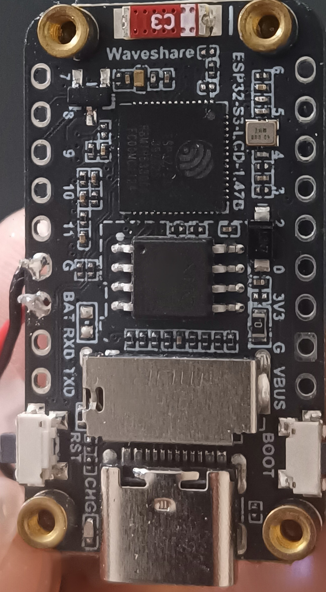

# ESP32-S3 IMU Sensor Platform

Live IMU visualization, BLE phone relay, and cloud vibration ingest for the **Waveshare ESP32-S3-LCD-1.47B** — a compact ESP32-S3 board with 172×320 TFT, QMI8658 6-axis IMU, LiPo battery input, and integrated BLE/WiFi.

This repository bundles everything needed to build, flash, and operate the full stack:

| Component | Path | Role |
|-----------|------|------|
| **Zephyr firmware** (primary) | [`zephyr/`](zephyr/) | On-device app: IMU pipeline, live scene, BLE GATT, WiFi, power management |
| **Android app** | [`android/ESP32S3ImuSim/`](android/ESP32S3ImuSim/) | BLE client, live scene, vibration verdicts, cloud upload |
| **Backend** | [`backend/`](backend/) | FastAPI ingest + TimescaleDB + Grafana dashboards |

System overview: **[docs/architecture.md](docs/architecture.md)**

---

## Hardware at a glance

**Board:** [Waveshare ESP32-S3-LCD-1.47B](https://www.waveshare.com/esp32-s3-lcd-1.47b.htm) (rev B3)  
**Module:** ESP32-S3-WROOM-1 **N8R8** — 8 MB flash, 8 MB octal PSRAM  
**USB:** Type-C CDC console @ **115200** baud (typically `/dev/ttyACM0`)

| Peripheral | Chip / signal | Zephyr driver / code |
|------------|---------------|----------------------|
| CPU | ESP32-S3 Xtensa LX7 @ 240 MHz | `clock_control` + `power_manager.c` |
| Display | ST7789V 172×320 SPI | `sitronix,st7789v` + MIPI DBI SPI |
| IMU | QMI8658 @ I2C 0x6B | `i2c_esp32` + `qmi8658.c` |
| Bluetooth | ESP32-S3 integrated BT | Zephyr BT host + `esp32_bt_hci` |
| WiFi | ESP32-S3 integrated | Zephyr `CONFIG_WIFI` + ESP32 shim |
| Battery | GPIO1, 200k/100k divider | `adc_esp32` + `battery_adc_esp32.c` |
| Backlight | GPIO46 PWM | LEDC via `panel_backlight.c` |
| BOOT | GPIO0 | `boot_button.c` |
| RGB edge | WS2812 on GPIO38 | Bit-bang `ws2812_gpio38.c` |

Full pin map and Kconfig: **[docs/zephyr-hardware.md](docs/zephyr-hardware.md)**

---

## Soldering the accumulator (taken from electronic cigarette)

Accu rated as 3.7V / 420mAh LiPo



Accu +3.7v (red) <-> BAT pin (ETA6098)
Accu Gnd (black) <-> G pin (common ground)

---

## Prerequisites

| Task | Guide |
|------|-------|
| Install Zephyr v3.7 + SDK 0.16.8 | [docs/zephyr-install.md](docs/zephyr-install.md) |
| Install arduino-cli + esp32 core | [docs/arduino-firmware.md](docs/arduino-firmware.md) |
| Android SDK + JDK 21 | [docs/android-app.md](docs/android-app.md) |
| Docker (backend) | [docs/backend.md](docs/backend.md) |

---

## Quick start — Zephyr (recommended)

### 1. One-time toolchain

Follow **[docs/zephyr-install.md](docs/zephyr-install.md)**. You need Zephyr **v3.7.0**, SDK **0.16.8**, target `xtensa-espressif_esp32s3_zephyr-elf`.

### 2. Build and flash

```bash
cd /path/to/esp32-s3-imu-basics
PORT=/dev/ttyACM0 ./zephyr/scripts/flash-zephyr.sh handshake
```

| App | Command | Purpose |
|-----|---------|---------|
| `handshake` | `flash-zephyr.sh handshake` | Full product firmware |
| `smoke` | `flash-zephyr.sh smoke` | BLE/LCD hardware test only |

The script symlinks the repo under `~/zephyrproject/` (avoids path-space issues), builds, flashes, captures serial, and verifies boot.

### 3. Expected boot output

```
handshake v14 — battery ADC curve-fit (Arduino parity)
QMI8658 ready at 0x6B
stage: main loop
BLE advertising started
telemetry screen=on target(cpu=240 render=30Hz imu=10Hz) actual(cpu=240 ...) bat=...V ...% src=...
```

Manual serial capture:

```bash
SKIP_RESET=1 ./zephyr/scripts/capture-serial-boot.sh /dev/ttyACM0 45 /tmp/boot.log
./zephyr/scripts/verify-boot-log.sh /tmp/boot.log
```

More detail: **[docs/zephyr-build.md](docs/zephyr-build.md)**

---

## Quick start — Android app

```bash
cd android/ESP32S3ImuSim
export ANDROID_HOME="$HOME/Android/Sdk"
export JAVA_HOME="/usr/lib/jvm/openjdk-21"   # adjust for your system
./gradlew assembleDebug
adb install -r app/build/outputs/apk/debug/app-debug.apk
```

1. Open **ESP32S3ImuSim** → scan → connect to **ESP32S3 IMU sim**
2. Optional: **Cloud** → set backend URL + API key

Full guide: **[docs/android-app.md](docs/android-app.md)**

---

## Quick start — Backend

```bash
cd backend
export IMU_API_KEY='your-long-random-secret'
docker compose up -d --build
curl -s http://127.0.0.1:8080/v1/health
```

Services: API **8080**, Grafana **3000**, TimescaleDB internal.

Full guide: **[docs/backend.md](docs/backend.md)**

---

## Quick start — Arduino (reference / fallback)

Mature battery calibration and production UI:

```bash
cd esp32_s3_imu_basics
PORT=/dev/ttyACM0 ./scripts/build.sh production --upload
```

Before first Zephyr flash, consider a full 16 MB backup — see **[backups/README.md](backups/README.md)**.

Guide: **[docs/arduino-firmware.md](docs/arduino-firmware.md)**

---

## Power modes (Zephyr `handshake`)

| State | CPU | IMU | Render | Backlight |
|-------|-----|-----|--------|-----------|
| Screen **ON** (default) | 240 MHz | 10 Hz | ~30 Hz target (~21 Hz measured) | 40% |
| Screen **OFF** (BOOT tap) | 160 MHz | 100 Hz | off | off |

Telemetry prints every **10 s** on USB serial.

**BOOT button (GPIO0):**

| Action | Effect |
|--------|--------|
| Short tap (after 3.5 s boot grace) | Toggle screen / backlight |
| Hold 10 s (release → press → hold) | Erase WiFi NVS profiles + reboot |

---

## Battery HUD

| Label | Meaning |
|-------|---------|
| `BAT 82%` | Running from battery |
| `DC 4.05V` | USB/charge path, cell visible on ADC |
| `DC ext` | USB power but ADC below 3.25 V (no cell on JST or empty header) |

Zephyr mirrors Arduino logic: GPIO1, 200k/100k divider, eFuse curve-fit ADC, trend-based DC/BAT detection.

Details: **[docs/battery.md](docs/battery.md)**

---

## Documentation index

| Document | Contents |
|----------|----------|
| [docs/architecture.md](docs/architecture.md) | System diagram, use cases, BLE services |
| [docs/zephyr-install.md](docs/zephyr-install.md) | Zephyr + SDK install (Linux/Gentoo/Debian) |
| [docs/zephyr-hardware.md](docs/zephyr-hardware.md) | Ported peripherals, drivers, CPU scaling, partitions |
| [docs/zephyr-build.md](docs/zephyr-build.md) | Build, flash, serial, troubleshooting |
| [docs/arduino-firmware.md](docs/arduino-firmware.md) | Arduino profiles, upload, battery reference |
| [docs/android-app.md](docs/android-app.md) | Build/install APK, BLE/cloud settings |
| [docs/backend.md](docs/backend.md) | Docker deploy, API, Grafana, firewall |
| [docs/battery.md](docs/battery.md) | ADC path, HUD labels, validation |
| [docs/zephyr-experiment.md](docs/zephyr-experiment.md) | Zephyr port notes and history |

---

## Troubleshooting (common)

| Problem | Check |
|---------|-------|
| Flash fails | Hold **BOOT**, tap **RESET**, release BOOT → download mode |
| No serial output | Wait 7 s after flash; increase capture time; tap RESET |
| Reboot loop | Serial shows repeated `handshake: main()` — update to v12+ BOOT fix |
| Wrong pins / blank LCD | Board must be `esp32s3_lcd_147b`, not generic devkit |
| App won't connect | Only one board named **ESP32S3 IMU sim** nearby; flash `handshake` not `smoke` |
| Battery shows `DC ext` on USB | Connect LiPo to JST; see [docs/battery.md](docs/battery.md) |
| Restore Arduino | `./backups/restore-arduino-fullflash.sh` or Arduino production upload |

---

## License

Project firmware and apps — use and modify per your deployment needs. Third-party components (Zephyr, ESP-IDF HAL, Waveshare demos) retain their respective licenses.
