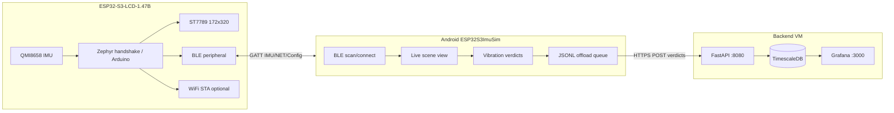

# System architecture

End-to-end data flow for the ESP32-S3 IMU sensor platform.

## Components

## Use cases

| Case | Path | Description |
|------|------|-------------|
| **A** | Board → WiFi → (future) | Body sensor with direct network when available |
| **B** | Board → BLE → Phone → Backend | Machine vibration: edge verdict on phone, upload when online |
| **C** | Board → BLE → Phone | Phone-as-transmitter: live IMU scene, optional cloud |

The **handshake** firmware and Android app implement Case B/C today. The backend ingests **verdicts only** (low-rate JSON), not raw IMU streams.

## Firmware tracks

| Track | When to use |
|-------|-------------|
| **Zephyr `handshake`** | Primary development — IMU, scene, BLE GATT, WiFi, power profiles |
| **Zephyr `smoke`** | Hardware sanity — LCD, BOOT, BLE advertising only |
| **Arduino `production`** | Reference behaviour — battery calibration, mature UI, fallback |

See [dual-firmware-probing.md](dual-firmware-probing.md) for switching between tracks.

## BLE services (handshake)

| Service | UUID prefix | Purpose |
|---------|-------------|---------|
| IMU | `4a6e0001-…` | Live samples, mode, caps, status |
| NET | `4a6e0101-…` | WiFi profile provisioning, HTTP proxy |
| Config | `4a6e0201-…` | Device settings |
| OTA | `4a6e0301-…` | MCUboot image transfer |

Protocol headers: `zephyr/app/common/ble_imu_protocol.h`, `esp32_s3_imu_basics/ble/ble_protocol.h`, Android `ImuProtocol.kt`.

## Storage

| Store | Location | Contents |
|-------|----------|----------|
| NVS (board) | Zephyr `storage` partition | WiFi profiles, device config |
| Offload (phone) | `files/offload/verdicts.jsonl` | Pending verdict uploads |
| Postgres (backend) | Docker volume | Ingested verdict rows |

## Typical deploy sequence

1. Flash **handshake** on the board → [zephyr-build.md](zephyr-build.md)
2. Install **Android APK** → [android-app.md](android-app.md)
3. Start **backend** on a LAN VM → [backend.md](backend.md)
4. Configure Cloud URL + API key in the app
5. Connect BLE, verify scene; verdicts upload when network is up
