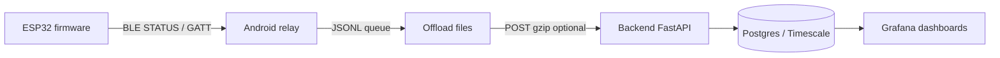

# Metrics pipeline — what we report today

Schema envelope for all cloud ingest: **`imu.ingest.v1`**.  
Base URL (production): `https://apps.f0xx.org/app/good_vibes/v1/…`

---

## 1. End-to-end path



Heavy math (FFT, band RMS, correlation) runs **on-device** for vibro verdicts; phone FFT is used for optional spectrum upload. Pending rows are queued on the phone when cloud is off or BLE-only.

---

## 2. Metrics successfully reported to the backend

### 2.1 Verdicts — `POST /v1/ingest/verdicts`

| Field | Source | ESP STATUS key | Stored |
|-------|--------|----------------|--------|
| `seq`, `ts_ms` | Phone at export | `s` | `verdicts.seq`, `ts_ms` |
| `level` / `candidate_level` | Edge window only — not the mechanic page | `vd` (0=OK, 1=WARN, 2=ALERT) | `verdicts.level` |
| `rms`, `peak` | Live capture | `vrms`, `vpeak` | columns |
| `corr`, `rms_delta` | vs reference | `vcorr`, `vrmsd` | columns |
| `pct`, `voltage` | Battery | `pct`, `v` | columns |
| `power_profile` | Power manager | `pp` | column |
| `chip_temp_c` | IMU / SoC | `tc` | column |
| `band_corr`, `band_delta_max` | 64-pt FFT bands | `bcorr`, `bdmax` | `raw_json` + API expand |
| `bands[4]` | Band RMS | `bnd[]` or compact `b16[]` | `raw_json` |
| `edge_crest`, `edge_zcr_hz`, `edge_hf_ratio` | Time-domain | `cr`, `zcr`, `hfr` | `raw_json` |
| `edge_score`, `edge_risk` | **Server computed** | — | `raw_json` on ingest |
| `session_seq` | Offload spool | `psess` | `raw_json` |
| `cap_mix_sec` | Capture schedule | `capmix` | `raw_json` |

Dedup: `(device_id, seq)`.

### 2.1b Operator page — `GET /v1/devices/{id}/operator_status`

Edge `vd` is **candidate_level** only. The mechanic page is computed on ingest:

- Last 30 `edge_score` samples, **dropping** `ts_ms` inside any `repair_events` interval for that device/machine.
- Mann–Kendall (`trend_score.py`: threshold 0.35, `early_warning` if increasing and latest-high or score ≥ 0.6).
- **operator ALARM** (`operator_alert=true`) if trend is increasing **and** last 3 candidates ≥ WARN **and** score ≥ 0.6.
- Proofs: last 5 rms/corr/bands/`edge_flags`. FTA hints attach only IMU-speakable mechanical leaves (`backend/app/fta_templates/`).

Also: `GET /v1/machines/{key}/operator_status` (ALARM if **any** sensor crosses), `POST /v1/machines/{key}/repairs` `{action: start|end}`.

### 2.2 Spectra — `POST /v1/ingest/spectra`

| Field | Source | Notes |
|-------|--------|-------|
| `seq`, `sample_hz`, `bin_hz` | Phone `VibroFft` on RAW IMU | User-triggered FFT menu |
| `bins[]` (128) | Magnitude spectrum | DC bin dropped |
| `peak_hz`, `peak_mag` | Peak search | |
| `axis` | `"mag"` | |

### 2.3 Crashes — `POST /v1/ingest/crashes`

| Field | Source |
|-------|--------|
| `reason`, `pc`, `exccause`, `excvaddr` | Crash ring GATT |
| `thread_name`, `fw_version`, `reset_reason`, `uptime_ms` | |
| `backtrace[]`, `detail` | Symbolicated server-side when ELF staged |

### 2.4 Battery bench — `POST /v1/ingest/battery_bench`

| Field | Source |
|-------|--------|
| `session_id`, `seq`, `ts_ms` | STATUS `bsid`, `bseq` + phone clock |
| `voltage`, `pct`, `trend_v`, `src` | STATUS `v`, `pct`, `tr`, `p` |
| `cpu_mhz`, `imu_hz`, `render_hz`, `chip_temp_c`, `uptime_ms` | STATUS / bench snapshot |
| `session_started_ms`, `session_stopped`, `label` | Phone session metadata |
| `est_ma` | **Server computed** from dV/dt (500 mAh default) |

### 2.5 Clock events — `POST /v1/ingest/clock` *(v124+)*

| Field | Source |
|-------|--------|
| `drift_ms`, `corr_ms`, `tz_min`, `unix_sec`, `src` | STATUS `clkd`, `clkc`, `tz`, `clku`, `clksrc` |

### 2.6 Reference profiles — `PUT /devices/{id}/reference_profiles/{slot}` + `POST /v1/ingest/reference_profiles` *(v124+)*

| Field | Source |
|-------|--------|
| `slot`, `name`, `duration_ms`, `sample_hz` | Device reflist GATT |
| `bands[4]` | Ref profile band RMS |
| `raw.mag_f16` / `raw.bins` | Compact magnitude fingerprint (optional) |
| `active` | Active slot flag |

### 2.7 Device config — `POST /v1/ingest/config`

188-byte `device_config_v1` blob + JSON mirror; not part of `uploadAll()`.

### 2.8 Query-only / metadata

| API | Purpose |
|-----|---------|
| `GET /devices/{id}/verdicts` | History + edge fields |
| `GET /devices/{id}/trend` | Rolling trend |
| `GET /devices/{id}/battery_bench/sessions` | Bench sessions |
| `machines`, `sensors` | Registry (profiles.txt vision) |

---

## 3. Not persisted (by design today)

| Data | Why |
|------|-----|
| Live IMU RAW/COMPUTED/SCENE batches | BLE NOTIFY → UI only |
| WiFi net STATUS JSON | Local wizard |
| Full reference `mag[512]` waveform | Flash-only; cloud gets bands + optional f16 digest |

---

## 4. Compression & compact formats *(v124+)*

### 4.1 Design rule

**Semantic layer unchanged** (verdict levels, bands, spectra). **Encoding layer** may compact:

| Layer | Format |
|-------|--------|
| BLE STATUS bands | `b16`: 4× IEEE754 float16 as JSON uint16 array (8 bytes vs ~40 bytes text `bnd`) |
| Phone JSONL | `MetricsCompact`: optional gzip blob file `verdicts.jsonl.gz` |
| HTTP ingest | `Content-Encoding: gzip` accepted on POST bodies |
| Flash verdict store | 4 band RMS already float32; mag refs use f16 in cloud upload payload |

### 4.2 Float16 band encoding

```
f16 = round(clamp(band_rms, 0, 65504) to float16)
on wire: 4 × uint16 little-endian
```

Android and firmware share `metrics_f16` helpers.

---

## 5. DSP usage *(v124+)*

| Location | Engine |
|----------|--------|
| Firmware band RMS / ref FFT | `vibro_fft.c` — radix-2 Hanning RFFT (esp-dsp hook via `CONFIG_VIBRO_ESP_DSP`) |
| Android spectrum | `VibroFft.kt` — same algorithm; esp-dsp N/A on phone |
| Time-domain edges | `vibro_features.c` — no FFT |

All vibro **verdict** paths call `vibro_band_rms_compute_series()` → shared FFT core.

---

## 6. Reference calibration wizard *(Android v1.17+)*

1. Confirm **reset all reference slots** (gas turbine recalibration after vibro tube install).
2. For each reference **N of M** (M ≤ 5, user-chosen): record 5–15 s on-device.
3. On completion: upload profiles to backend; device listens for shakes.
4. A single WARN/ALERT window is a **candidate** (`vd`). It does **not** turn the acrylic LED red and does **not** page the mechanic.
5. Backend `GET /v1/devices/{id}/operator_status` (and machine equivalent) scores Mann–Kendall on `edge_score` after dropping repair intervals. **Operator ALARM** (page) needs an increasing trend, last 3 candidates ≥ WARN, and score ≥ 0.6.
6. After mechanical work (bearing / impeller / seal / remount): **START REPAIR** (CMD 14) → END REPAIR with FTA leaf → re-run the reference wizard when `new_ref_required`. Process/electrical with the same mount may keep refs and Arm (CMD 10).

---

## Appendix A — Extension plans & status

| Item | Status | Notes |
|------|--------|-------|
| Verdict edge fields in cloud | **Done** | `raw_json` + `_verdict_out()` |
| `session_seq`, `cap_mix_sec` upload | **Done v124** | CloudUploader forwards |
| Clock ingest table | **Done v124** | `clock_events` |
| Reference profile device→cloud | **Done v124** | Wizard + POST ingest |
| GATT compact `b16` bands | **Done v124** | STATUS when bands valid |
| JSONL gzip pending queue | **Done v124** | `MetricsCompact.kt` |
| HTTP gzip ingest | **Done v124** | FastAPI middleware |
| esp-dsp linked FFT | **Hook only** | Enable `CONFIG_VIBRO_ESP_DSP` when module in west |
| `POST /ingest/batches` IMU waveforms | **Planned** | ROADMAP |
| Mesh / Coded PHY metrics path | **Planned** | See BLE research notes |
| Sticker asset beacon | **Planned** | Separate product mode |
| Net/WiFi status persist | **Low priority** | Ops debug |
| Server-side reference→device download | **Planned** | Provision ideal profiles |
| Operator alert + FTA proofs + repair windows | **Done v186 / APK 1.31** | `repair_events`, `operator_status`, CMD 14 |

---

## Appendix B — Key files

| Layer | Path |
|-------|------|
| Protocol | `zephyr/app/common/ble_imu_protocol.h`, `ImuProtocol.kt` |
| Vibro DSP | `zephyr/app/common/vibro_fft.c`, `vibro_band_rms.c` |
| LED anomaly | `zephyr/app/handshake/src/vibro_led.c` |
| Android upload | `CloudUploader.kt`, `OffloadExporter.kt`, `MetricsCompact.kt` |
| Ref wizard | `VibroRefWizardActivity.kt` |
| Backend | `backend/app/api.py`, `models.py`, `schemas.py` |
