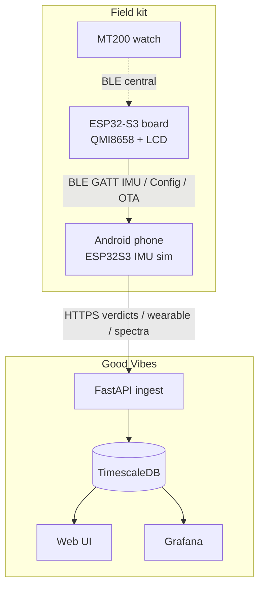
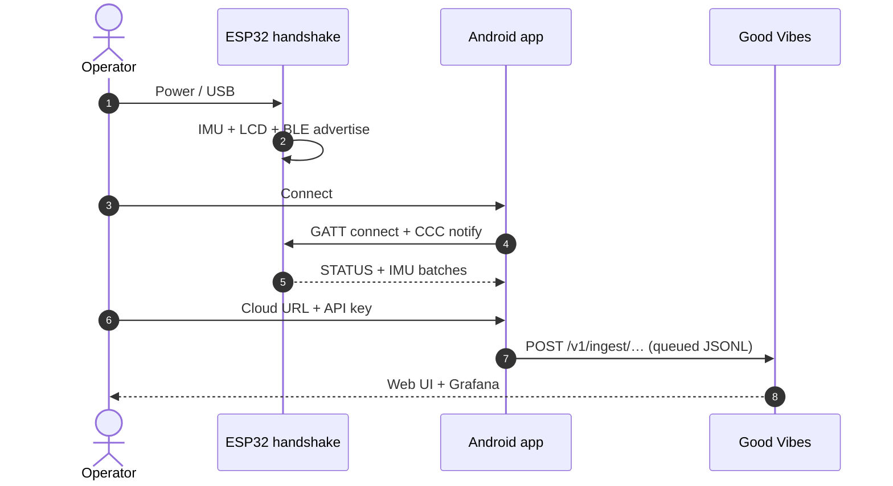
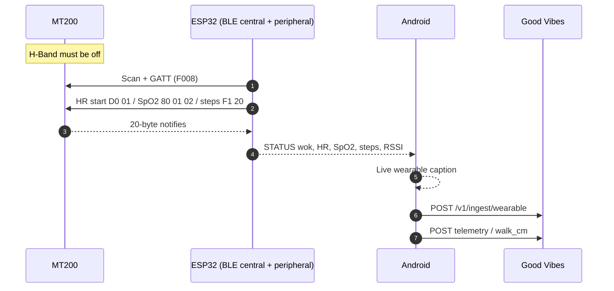
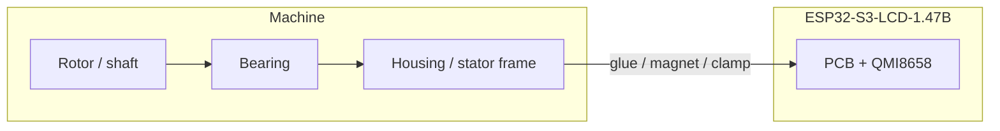
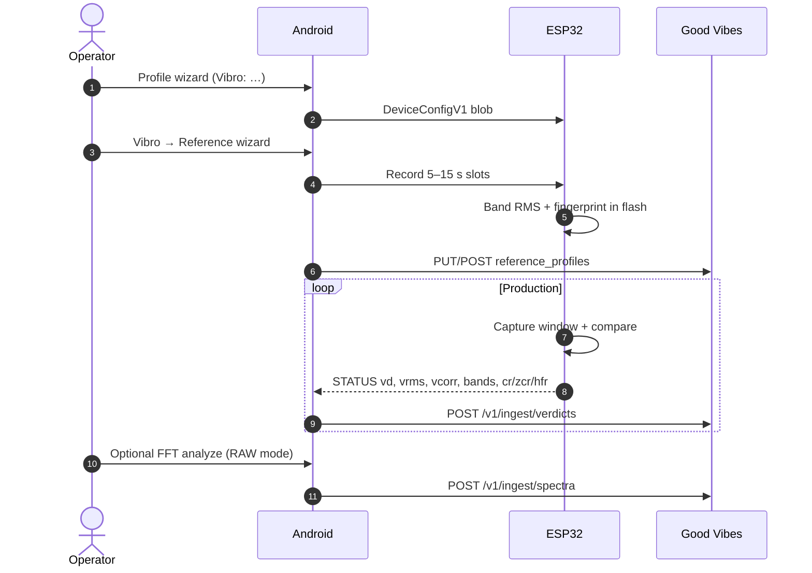
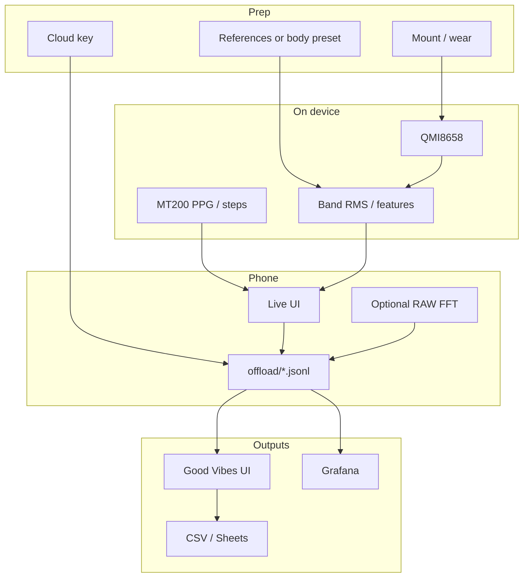

# Operator HOW-TO — ESP32-S3 IMU, phone, and MT200

## Contents

- [0. Read this first](#0-read-this-first)
  - [Topology cheat-sheet](#topology-cheat-sheet)
- [1. Shared prerequisites (every use case)](#1-shared-prerequisites-every-use-case)
  - [1.1 Hardware checklist](#11-hardware-checklist)
  - [1.2 First boot — board](#12-first-boot-board)
  - [1.3 First launch — phone](#13-first-launch-phone)
  - [1.4 Cloud (do this once if you want dashboards)](#14-cloud-do-this-once-if-you-want-dashboards)
  - [1.5 Where to look — three layers](#15-where-to-look-three-layers)
- [2. Body health measurements](#2-body-health-measurements)
  - [2.1 Variant A — ESP32 only (no watch)](#21-variant-a-esp32-only-no-watch)
  - [2.2 Variant B — ESP32 + MT200 (recommended for HR / SpO2)](#22-variant-b-esp32-mt200-recommended-for-hr-spo2)
  - [2.3 Preparations (body)](#23-preparations-body)
  - [2.4 Phone pipeline (body)](#24-phone-pipeline-body)
  - [2.5 Metrics — attention, dashboard, raw](#25-metrics-attention-dashboard-raw)
- [3. Vibration analysis (machines)](#3-vibration-analysis-machines)
  - [3.1 What you are actually measuring](#31-what-you-are-actually-measuring)
  - [3.2 Preparations (vibro)](#32-preparations-vibro)
  - [3.3 Phone pipeline (vibro)](#33-phone-pipeline-vibro)
  - [3.4 Metrics — attention, dashboard, raw](#34-metrics-attention-dashboard-raw)
- [4. Other operator workflows](#4-other-operator-workflows)
  - [4.1 Floor / mounting calibration](#41-floor-mounting-calibration)
  - [4.2 AHRS / orientation lab](#42-ahrs-orientation-lab)
  - [4.3 Battery bench](#43-battery-bench)
  - [4.4 WiFi wizard (provisioning only)](#44-wifi-wizard-provisioning-only)
  - [4.5 OTA (app then firmware)](#45-ota-app-then-firmware)
  - [4.6 Crash debug (lab)](#46-crash-debug-lab)
- [5. Topology deep-dive (FAQ of combinations)](#5-topology-deep-dive-faq-of-combinations)
  - [5.1 ESP32 + phone (no watch)](#51-esp32-phone-no-watch)
  - [5.2 ESP32 + MT200 + phone](#52-esp32-mt200-phone)
  - [5.3 MT200 + phone (no ESP32)](#53-mt200-phone-no-esp32)
  - [5.4 ESP32 + MT200, no phone](#54-esp32-mt200-no-phone)
  - [5.5 Two phones](#55-two-phones)
  - [5.6 Autopilot / rendezvous (unattended vibro)](#56-autopilot-rendezvous-unattended-vibro)
- [6. Data analysis — from prep to output](#6-data-analysis-from-prep-to-output)
- [7. Troubleshooting FAQ](#7-troubleshooting-faq)
- [8. Quick recipes](#8-quick-recipes)
- [9. File / URL index](#9-file-url-index)
- [Appendix: Acrylic status LED](#appendix-acrylic-status-led)

<!-- pdf:toc-end -->

**Audience:** field operator (not firmware developer).  
**Kit:** Waveshare **ESP32-S3-LCD-1.47B** (QMI8658 IMU), Android app **ESP32S3 IMU sim**, optional **Veepoo / H-Band MT200** watch, optional cloud **Good Vibes**.  
**Firmware on the board:** handshake (`handshake v160` at the time of writing). BLE name: `ESP32S3 IMU sim`.  
**Cloud (production):** `https://apps.f0xx.org/app/good_vibes`

This is the complete field FAQ: every supported topology, how to prepare hardware, how to tune the phone pipeline, and where each metric lives (app vs Grafana vs raw files).

---

## 0. Read this first

| Rule | Why |
|------|-----|
| The **phone never talks to the MT200**. Only the ESP32 can hold the watch link. | The watch is **single-LE-link**. H-Band XOR ESP32 XOR a laptop. |
| The **ESP32 never talks to Good Vibes by itself** in the current handshake build. | WiFi STA is compiled **off** (`CONFIG_WIFI=n`). The phone is the relay. |
| **Raw IMU samples stay on the BLE link / phone UI.** Cloud stores **verdicts**, **wearable samples**, **spectra (on demand)**, **crashes**, **battery bench**. | Bandwidth and flash. |
| Glue the **board**, not a flying wire to the IMU. The QMI8658 is on the PCB (I2C SDA 48 / SCL 47). | You measure whatever mechanical path reaches that chip. |
| After moving the sensor to a new machine, **re-run the reference wizard**. | Old “healthy” fingerprints become false ALERTs. |

### Topology cheat-sheet

| Case | Hardware | Our app? | What you get |
|------|----------|----------|----------------|
| **A** ESP32 + phone | Board + Android | Yes | Live IMU, steps/walk, vibro, AHRS, cloud relay |
| **B** ESP32 + MT200 + phone | Board + watch + Android | Yes | Case A **plus** HR / SpO2 / steps from the watch, hop RSSI |
| **C** MT200 + phone only | Watch + H-Band | **No** | Use the vendor **H Band** app. ESP32S3ImuSim cannot pair the watch. |
| **D** ESP32 alone | Board, no phone | Limited | LCD scene, RGB LED, local verdicts; **no cloud**, no watch (bridge needs the debug build, still no HTTP) |
| **E** ESP32 + WiFi (no phone) | — | **Not current** | Handshake has WiFi **disabled**. Re-enable only with a coexistence-tested firmware. |

---

## 1. Shared prerequisites (every use case)

### 1.1 Hardware checklist

1. Board charged or on USB-C (USB is fine for setup; **unplug USB** for battery-life or vibro-on-machine work).
2. Phone: Bluetooth on, location permission allowed (Android BLE scan), notification permission for the foreground relay.
3. App installed: package `com.esp32s3.imusim`. Test phone in this project is BL6000Pro; any Android 8+ works.
4. Optional watch: MT200 charged, **H Band force-stopped and Bluetooth disconnected from the watch**. If H-Band holds the link, the ESP32 cannot connect.

### 1.2 First boot — board

1. USB-C to a PC if you need a console; otherwise just power the battery.
2. LCD should show the handshake scene (horizon / live IMU). Serial (115200) should contain `handshake vNN`, `crash ring ready`, `BOOT armed (released=1)`.
3. BLE advertising name: **ESP32S3 IMU sim**.
4. Acrylic edge LED (WS2812 on GPIO38) shows setup / arm / fault / battery — see [Appendix: Acrylic status LED](#appendix-acrylic-status-led).

### 1.3 First launch — phone

1. Open **ESP32S3 IMU sim**.
2. Grant Bluetooth / nearby devices / notifications when asked.
3. Tap **Connect**. Wait until the status line shows connected (not “Disconnected”).
4. Leave the app in the background if you want the **autopilot relay** (periodic BLE sync). Foreground gives the live scene.

### 1.4 Cloud (do this once if you want dashboards)

1. **Device… → Cloud**.
2. URL: `https://apps.f0xx.org/app/good_vibes` (default).
3. Paste the API key (or **Import from clipboard** / setup link).
4. Device ID: leave default or set a stable name per board (Grafana filters on this).
5. Group ID: e.g. `press-1`, `body-lab`.
6. **Test connection**, then **Upload now** after you have data.
7. Bridge mode: leave **Rendezvous** unless you are lab-debugging (then shorter interval).

### 1.5 Where to look — three layers

| Layer | What it is | When to use |
|-------|------------|-------------|
| **Phone UI** | Live scene, vibro caption, banners | Tuning, “is it alive?” |
| **Good Vibes web** | `…/app/good_vibes/` verdicts; `…/wearable` live HR/steps | Shift overview, CSV/TSV export |
| **Grafana** | Verdicts, wearable, crashes, battery bench | Trends, lag, RSSI, edge features |

Production Grafana (behind the same host): `https://apps.f0xx.org/app/good_vibes/grafana/`

| Dashboard | UID | Use |
|-----------|-----|-----|
| ESP32 IMU Verdicts | `imu-verdicts` | RMS, corr, bands, edge, battery, ingest lag |
| Wearable (MT200) | `imu-wearable` | HR, SpO2, steps, walk_cm, hop RSSI, silent gaps |
| ESP32 IMU Crashes | `imu-crashes` | Fault ring uploads |
| Battery bench | `imu-battery-bench` | Discharge sessions |

---

## 2. Body health measurements

Two hardware variants. Software path is the same on the phone; the watch only adds PPG / step counter samples.

### 2.1 Variant A — ESP32 only (no watch)

**What the board measures:** 6-axis IMU (accel + gyro). Firmware derives **walk distance / steps-like walk_cm**, attitude, and live scene. There is **no optical HR or SpO2** on the ESP32.

**What you watch for:** motion, gait/walk_cm, orientation, battery, chip temperature.

### 2.2 Variant B — ESP32 + MT200 (recommended for HR / SpO2)

**What the watch measures:** heart rate, SpO2, on-watch step counter, watch battery.  
**What the ESP32 adds:** IMU walk_cm, BLE RSSI of the watch hop, relay to the phone.

**Hard rules**

- Wear the watch **snug, optical window on skin**. Table / no contact → HR stays `0` for ~30 s then still 0 (not a firmware bug).
- HR lock takes **~30 s** on-wrist (`D0` frames). SpO2 is **mutually exclusive with HR** (shared PPG). Firmware cycles them; do not expect both at 1 Hz.
- **Quit H Band** completely before powering the ESP32 bridge.
- Wrist RSSI is often −70 dBm on a table and −80…−86 dBm on-wrist. First connect can fail with RF noise; the bridge retries.

Current handshake merges crash-debug extras by default (`CRASH_DEBUG=1`), which **includes the MT200 central bridge** and autostart after BLE is up.

### 2.3 Preparations (body)

1. Charge board + watch. Confirm LCD alive.
2. Strap the board so the **IMU chip side** is toward the body segment you care about (waist / ankle / chest pack). Avoid a floppy lanyard — the QMI8658 will report strap bounce as motion.
3. Optional: **Device… → Floor level calibration** on a known-level table if you care about tilt, not if the board is worn loosely.
4. Phone: Connect BLE.
5. **Device… → Profile wizard** → **Body sensor (computed)** (live IMU + steps, performance power) **or** **Body sensor (scene mirror)** if you want the LCD/scene mode mirrored.
6. Cloud as in §1.4. Group ID e.g. `body`.
7. For watch: put MT200 on wrist, kill H-Band, wait ~1 min after ESP boot for HR lock.

### 2.4 Phone pipeline (body)

| Step | Menu / control | Setting |
|------|----------------|---------|
| 1 | Main **Connect** | Stay connected or rely on autopilot |
| 2 | Mode chips | **Computed IMU** for gait/steps; **Angles / scene** to watch the LCD horizon |
| 3 | Profile wizard | Body computed / body scene |
| 4 | Cloud | Enabled, device_id unique per wearer or per board |
| 5 | Do **not** open Vibro reference wizard | That path is for machines |
| 6 | Optional **AHRS live view** | Full CPU 240 MHz + 100 Hz IMU — **not** a battery saver; yaw drifts (no magnetometer) |

### 2.5 Metrics — attention, dashboard, raw

| Metric | Meaning | Healthy-ish | Phone | Dashboard | Raw |
|--------|---------|-------------|-------|-----------|-----|
| HR | Optical bpm | 40–180 locked; 0 = no lock | Wearable live page after upload | Grafana **Wearable** | `wearable_samples` kind=`hr` |
| SpO2 | % | 95–100 on-wrist; `1` on wire = wear fail, not 1% | Wearable page | Grafana Wearable | kind=`spo2` |
| Watch steps | Watch pedometer | Monotonic during walk | Wearable page | Grafana Wearable | kind=`steps` |
| IMU `walk_cm` | Board integrated walk | Rises when the **board** moves | STATUS / wearable page | Grafana Wearable (compare vs watch steps) | kind=`walk_cm` |
| ESP↔phone RSSI | Phone-measured | Roughly −40…−80 indoor | STATUS | Wearable RSSI panels | ingest rssi fields |
| MT200↔ESP RSSI | ESP-measured | −70 table, worse on wrist; −127 = N/A | STATUS | Wearable hop RSSI | `mt200` rssi |
| Battery % / V | Board LiPo | Trend down off USB | Main caption | Verdicts + wearable | STATUS `pct`,`v` |
| Chip temp | SoC | Rises in AHRS / sun | STATUS | Verdicts | `tc` |

**Do not** treat IMU walk_cm and watch steps as the same counter. They disagree on purpose (different sensors). Use them as a **cross-check**: watch steps up + walk_cm flat ⇒ board isn’t on the walking limb.

**Live web:** `https://apps.f0xx.org/app/good_vibes/wearable`  
**CSV:** Good Vibes **Download CSV** / Copy TSV (delivery lag included on new ingest).

---

## 3. Vibration analysis (machines)

This is the industrial path: edge FFT / band RMS **on the ESP32**, phone as relay, cloud verdicts.

### 3.1 What you are actually measuring

The QMI8658 sits on the **PCB**, near the I2C header (SDA GPIO48, SCL GPIO47). You are **not** measuring a bearing race directly unless the mechanical path is stiff.

| Target | Where to glue / clamp | Axis hint |
|--------|----------------------|-----------|
| **Rolling bearing (radial)** | Bearing housing, load zone if known; else drive-end cap | Radial = across shaft; keep board flat on housing |
| **Thrust / axial** | Housing face along shaft centreline | IMU X/Y in the plane of the board; note which way the USB points and **write it on the machine** |
| **Rotor unbalance** | Rigid housing, **not** a guard sheet-metal | Same as radial bearing |
| **Stator / frame** | Motor foot or stator yoke, away from cooling fans that flap | Often lower frequency; use **Low RPM** or **Ultra-low RPM** preset |
| **Gearbox** | Split line or bearing cap, not the inspection cover | |
| **Pump / fan** | Pump volute or fan pillow block | Prefer **Intermittent** if the machine is not 24/7 |

**Mounting rules**

1. **Stiff path:** cyanoacrylate on a cleaned paint-free pad, or a strong magnet on a steel housing. Foam tape is for demos only (it low-pass-filters).
2. **One orientation forever** after the reference wizard. Rotating the board 90° invalidates fingerprints.
3. **Do not** mount on a vibrating cable tray or the plastic LCD bezel as the only contact — couple the **back of the PCB / metal can** to the machine.
4. LCD can face out for a glance; the IMU still needs the stiff path.
5. Keep USB cable off the machine while capturing (cable slap looks like an ALERT).

### 3.2 Preparations (vibro)

1. Machine in **normal idle / normal production** — not a crash-stop, not a cold start unless that *is* the reference.
2. Glue/clamp as above. Mark USB direction with a paint pen.
3. Phone BLE connect. Unplug USB from the board if you care about battery schedule / deep sleep.
4. **Device… → Profile wizard** — pick a vibro preset (table below).
5. **Vibro… → Reference wizard** on **this** mounting. Confirm erase if the sensor moved.
6. Cloud group_id = machine name. Device ID = this board.

### 3.3 Phone pipeline (vibro)

| Preset (Profile wizard) | When | Capture idea |
|-------------------------|------|----------------|
| **Vibro: normal** | Typical 50/60 Hz machines, continuous | ~15 s window / 60 s interval, 100 Hz IMU |
| **Vibro: low RPM diagnosis** | Slow shafts, more time per rev | 30 s / 120 s, 50 Hz |
| **Vibro: ultra-low RPM** | Very slow / high inertia | 60 s / 5 min, 25 Hz |
| **Vibro: intermittent machine** | Starts/stops; save battery | Hourly random slot, deep sleep, mix windows |
| **Vibro: machine monitor (mix)** | Unattended monitor | Intermittent + mix/dyn sub-windows |

Then:

1. **Vibro… → Reference wizard…**  
   - Erase slots if this is a new machine.  
   - Choose 1–5 references (3 is a good default).  
   - Each take: **normal idle vibration ~12 s**, hold still relative to the housing (you are not “shaking” a turbine).  
   - **Upload & finish**.
2. **Vibro… → Vibro mode** to switch diagnosis tier later without the full wizard.
3. **Vibro… → Capture mix…** (expert) only if you know mix/dyn ratios.
4. **Vibro… → FFT analyze** switches the ESP to **Raw IMU**, collects a burst, uploads a 128-bin spectrum. Use when Grafana verdicts look wrong and you want a picture of the line.
5. **Vibro… → Verdict history** — last on-phone levels without opening Grafana.

Acrylic LED (GPIO38): **red** solid on WARN/ALERT (and other NOK); **off** when armed and healthy. Colour chart: [Appendix: Acrylic status LED](#appendix-acrylic-status-led).

### 3.4 Metrics — attention, dashboard, raw

| Metric | Meaning | Attention | Phone | Dashboard | Raw |
|--------|---------|-----------|-------|-----------|-----|
| `vd` level | 0 OK, 1 WARN, 2 ALERT | ALERT after a good reference ⇒ process change or loose mount | Vibro caption | Grafana **Verdicts** | `verdicts.level` |
| `vrms` / `vpeak` | Time-domain energy | Step change after maintenance | Caption | Verdicts RMS panel | columns |
| `vcorr` / `bcorr` | Similarity to reference | Drop ⇒ spectral shape changed | Caption | band_corr panel | `raw_json` |
| `bdmax` | Worst band delta | Which band moved | Caption | band_delta_max | `raw_json` |
| `bnd[]` / `b16[]` | 4 band RMS | Compare to ref bands | — | band time series | `raw_json.bands` |
| `cr` crest | Peakiness | Impacts, looseness | Caption | edge_crest | `raw_json` |
| `zcr` | Zero-crossing rate | High-frequency hash | Caption | edge_zcr_hz | `raw_json` |
| `hfr` | High-frequency ratio | Bearing-ish vs 1× running speed | Caption | edge_hf_ratio | `raw_json` |
| `edge_score` / `edge_risk` | **Server** heuristic | Trend, not a trip | — | Verdicts | computed on ingest |
| Spectrum bins | Phone FFT of RAW | “What frequency?” | FFT toast | (API spectra) | `POST /v1/ingest/spectra` |
| LED | Local | Red = act now | Eyes | — | — |

**Live web:** `https://apps.f0xx.org/app/good_vibes/`  
**Do not** stare at live RAW IMU in Grafana — it is not stored. Use FFT upload or the phone scene.

**False ALERT checklist:** loose glue, USB cable, reference taken while the machine was off, board rotated, nearby hammering, deep-sleep preset on a machine that should be continuous.

---

## 4. Other operator workflows

### 4.1 Floor / mounting calibration

**Device… → Floor level calibration…**

- Purpose: persistent tilt correction vs a **true level** (bubble). Not a vibration reference.
- Place board on a known-flat surface, still, **Start**.
- Clear if you remount at a new angle.

### 4.2 AHRS / orientation lab

**Device… → AHRS live view (full speed)…**

- Complementary filter, gyro+accel, **no magnetometer** → yaw drifts.
- Forces 240 MHz + 100 Hz. Leave the screen to restore Auto.
- 3D debug page on the backend: `ahrs.html` (lab).

### 4.3 Battery bench

**Device… → Battery bench…**

- Unplug USB. Start. Config locks until Stop.
- Samples upload when cloud is on. Grafana **Battery bench**.

### 4.4 WiFi wizard (provisioning only)

**Device… → WiFi wizard** still talks **over BLE**. Handshake **does not bring WiFi STA up** in the current `prj.conf`. Use it only if you are on a firmware that re-enabled WiFi. Hotspot fallback (when implemented on that build): `ESP32-IMU-Setup` / `imu12345` → `http://192.168.4.1`.

### 4.5 OTA (app then firmware)

1. Phone and board connected (or autopilot will pick up later).
2. **Device… → Check for OTA**.
3. **APK first**, then firmware. The phone refuses FW OTA if the app is too old (`min_apk_versionCode`).
4. USB `flash-zephyr.sh handshake` remains the recovery path if BLE OTA fails.

### 4.6 Crash debug (lab)

**Device… → Crash debug (dev)…** only on builds with `dbg=1`. Injects a fault; relay uploads the crash ring. Grafana **Crashes**. Do not use on a production machine capture.

---

## 5. Topology deep-dive (FAQ of combinations)

### 5.1 ESP32 + phone (no watch)

**Use:** body IMU, vibration, AHRS, battery bench.  
**You will not see:** HR, SpO2, watch steps. Wearable page may still show `walk_cm` from the IMU.

### 5.2 ESP32 + MT200 + phone

**Use:** body health with optical sensors **and** optional vibro if the board is also on a machine (unusual — pick one mounting).  
**Setup extra:** H-Band off; wait for HR lock; compare watch steps vs `walk_cm`.

### 5.3 MT200 + phone (no ESP32)

**Not supported by ESP32S3 IMU sim.** Use **H Band**. Our cloud never sees those samples unless some other bridge exists.

### 5.4 ESP32 + MT200, no phone

Watch samples sit in ESP RAM/STATUS only. **No Good Vibes**. LCD will not show a medical dashboard. Bring a phone for ingest.

### 5.5 Two phones

Only one BLE central should hold the ESP32. A second phone can open Good Vibes in a browser (cloud), not a second BLE connection.

### 5.6 Autopilot / rendezvous (unattended vibro)

Phone in a locker near the machine:

1. Cloud on, bridge **Rendezvous**.
2. Intermittent / machine-monitor preset so the ESP sleeps between windows.
3. Phone must stay powered and in BLE range. WorkManager uploads when the WAN is up.

```mermaid
sequenceDiagram
  autonumber
  participant ESP as ESP32
  participant Phone as Phone (background)
  participant Cloud as Cloud
  Note over ESP: Deep sleep / capture window
  ESP->>ESP: Wake + capture + verdict
  Phone->>ESP: Rendezvous connect (preconnect)
  ESP-->>Phone: STATUS + spool ACK
  Phone->>Cloud: JSONL flush
  Phone->>ESP: Disconnect
  ESP->>ESP: Sleep until next slot
```

---

## 6. Data analysis — from prep to output

**Recommended daily loop**

1. Grafana Wearable or Verdicts — last 24 h, look for **holes** (relay down) vs **ALERT clusters** (real process).
2. Good Vibes table — CSV if you need Sheets.
3. Phone only when Grafana is ambiguous (FFT, ref wizard, LED).

**Export:** Good Vibes **Download CSV** joins wearable + telemetry + verdicts + ingest batches (`lag_ms`, RSSI, bytes). Historical rows may have empty `delivered_at` until new ingest.

---

## 7. Troubleshooting FAQ

**Connect button does nothing / scan empty**  
Bluetooth + location permission; board advertising; another phone already connected.

**Connected but no IMU**  
Wait 2 s for CCC; reboot board; confirm handshake not `smoke` firmware (`WS147B-Zephyr` is smoke-only).

**Watch never locks HR**  
H-Band still connected; watch not on skin; wait 30+ s; RSSI −90 or −127; crash-debug/MT200 not in this image (`CRASH_DEBUG=0`).

**SpO2 is 1%**  
Wear-fail flag, not saturation. Tighten strap. Stop expecting HR in the same second.

**ALERT with a quiet machine**  
Bad or empty references; mount loose; USB cable; board moved. Re-wizard.

**Grafana empty, phone live**  
Cloud key/URL; **Upload now**; WAN; device_id mismatch vs Grafana variable.

**Two data holes: wearable vs verdicts**  
Different pipelines. Wearable is fire-and-forget; verdicts retry via JSONL. A quiet STATUS does not mean the watch ingest died.

**OTA offered forever**  
Phone APK still older than manifest `min_apk_versionCode`, or FW_VERSION_CODE not bumped on the image you flashed.

**Cast builder vs IMU builder (lab)**  
Android Cast and IMU are **separate tenants**. IMU jobs must show project `imu`, containers `imu-bld-*` / `imu-zephyr-bld-*`, channel `imu`. Never `androidcast-bld-*`, never Cast OTA version `00.01.00.xxxx`. See `ci/cast/README.md`.

**What does the acrylic LED colour mean? (board status / readiness)**  
Single WS2812 on GPIO38. ✓ = that RGB channel is on. Empty = off. `*reserved*` = that colour combo is not wired. Flash is 2 s on / 2 s off. Healthy armed run is **off**. Full date/FW wiring: [Appendix: Acrylic status LED](#appendix-acrylic-status-led).

| Condition | R | G | B |
|-----------|---|---|---|
| Setup — no reference profiles (solid blue) | | | ✓ |
| Await arm — refs recorded, not started (blue flash 2s/2s) | | | ✓ |
| OK pulse — NVS/config saved (~2 s solid blue) | | | ✓ |
| NOK — WARN/ALERT or armed without loaded ref (solid red) | ✓ | | |
| Battery ≤10% SOC on battery, not USB/DC (yellow flash 2s/2s) | ✓ | ✓ | |
| Operational — armed, refs OK, no fault (off) | | | |
| Green only | *reserved* | *reserved* | *reserved* |
| Magenta (R+B) | *reserved* | *reserved* | *reserved* |
| Cyan (G+B) | *reserved* | *reserved* | *reserved* |
| White (R+G+B) | *reserved* | *reserved* | *reserved* |

---

## 8. Quick recipes

**Body + watch, 10 minutes**  
Kill H-Band → power ESP → Connect phone → Profile **Body sensor (computed)** → Cloud on → wear watch → wait for HR → open `/wearable`.

**New pump, 20 minutes**  
Glue on bearing cap → Connect → Profile **Vibro: normal** → Reference wizard ×3 at idle → Cloud group `pump-7` → confirm LED **off** after arm (healthy run) → Grafana Verdicts.

**Overnight unattended**  
Intermittent or machine-monitor preset → Rendezvous bridge → phone plugged in BLE range → morning Grafana + CSV.

---

## 9. File / URL index

| Thing | Where |
|-------|--------|
| App package | `com.esp32s3.imusim` |
| BLE name | `ESP32S3 IMU sim` |
| Cloud | `https://apps.f0xx.org/app/good_vibes` |
| Wearable UI | `…/wearable` |
| Grafana | `…/grafana/` |
| Phone queue | app files `offload/verdicts.jsonl` (+ gzip) |
| Firmware flash | `zephyr/scripts/flash-zephyr.sh handshake` |
| Acrylic LED colours | [Appendix: Acrylic status LED](#appendix-acrylic-status-led) |
| MT200 protocol notes | [veepoo-proto-ble-reverse.md](veepoo-proto-ble-reverse.md) |
| Metrics schema | [metrics.md](metrics.md) |
| Architecture | [architecture.md](architecture.md) |

---

## Appendix: Acrylic status LED

**Wired:** 2026-08-23 (handshake `vibro_led.c` schema in commit `7de0208`).  
**Firmware:** `handshake v160` (`FW_VERSION_NAME` / `FW_VERSION_CODE` 160 in `zephyr/app/common/fw_version.h`).

The red acrylic edge light is a **single WS2812** pixel on **GPIO38** (GRB wire order). Channel drive is 48/255 when on. Handshake turns the pixel **off** at boot, then `vibro_led` owns it for the rest of the run. The diffuser is red: a firmware **green** channel looks red through the plastic, so the “OK pulse” is driven as **blue**, not green.

**Solid vs flash.** Solid means the channel stays on. Flash is 2 s on / 2 s off (`LED_FLASH_PERIOD_MS` 4000, `LED_FLASH_ON_MS` 2000). The OK pulse is a **solid ~2 s** burst (`LED_OK_PULSE_MS`), then the base state returns. Flash off-phases look the same as operational off.

**Priority** (first match wins): OK pulse → battery critical → setup (no refs) → await arm → NOK → off.

✓ = that RGB channel is driven for the condition. Empty = channel off. `*reserved*` = that colour combo is **not wired** in this firmware.

| Condition | R | G | B |
|-----------|---|---|---|
| Setup — no reference profiles in flash (solid blue) | | | ✓ |
| Await arm — refs recorded, not started / CMD 10 (blue flash 2s/2s) | | | ✓ |
| OK pulse — NVS / config saved (~2 s solid blue) | | | ✓ |
| NOK — verdict WARN/ALERT, or armed without a loaded reference (solid red) | ✓ | | |
| Battery critical — ≤10% SOC **and** on battery, not USB/DC (yellow flash 2s/2s) | ✓ | ✓ | |
| Operational — armed, refs OK, no active fault (off) | | | |
| Green only | *reserved* | *reserved* | *reserved* |
| Magenta (R+B) | *reserved* | *reserved* | *reserved* |
| Cyan (G+B) | *reserved* | *reserved* | *reserved* |
| White (R+G+B) | *reserved* | *reserved* | *reserved* |

**Not a colour in this table.** BLE advertising, BLE connected, charging / on USB, OTA, crash, MT200 watch link, and WiFi do **not** set the acrylic LED. Charging specifically suppresses the yellow battery flash (`on_dc` → not critical). Smoke firmware (`WS147B-Zephyr`) only turns the pixel off; it does not use this schema.
