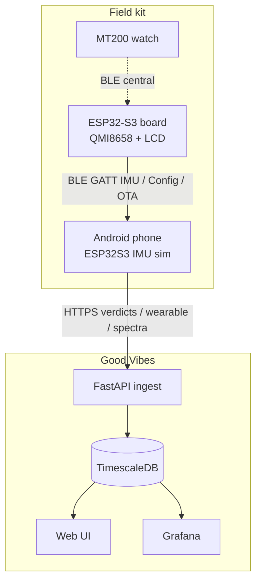
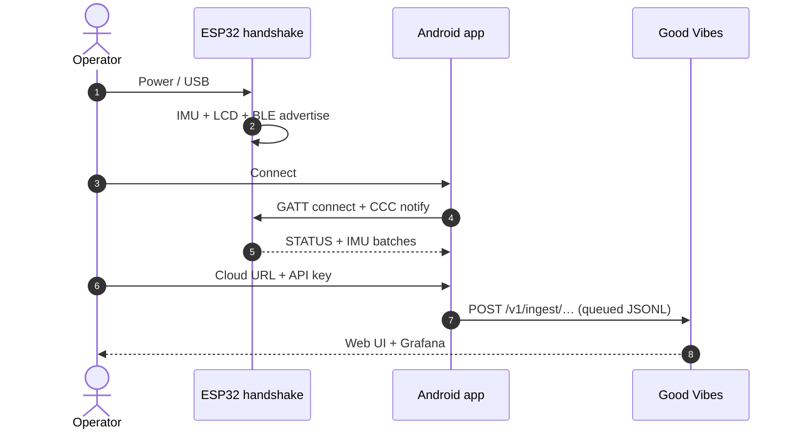
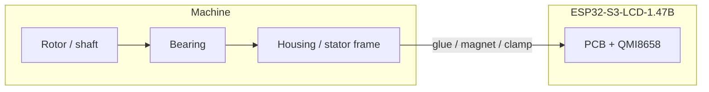
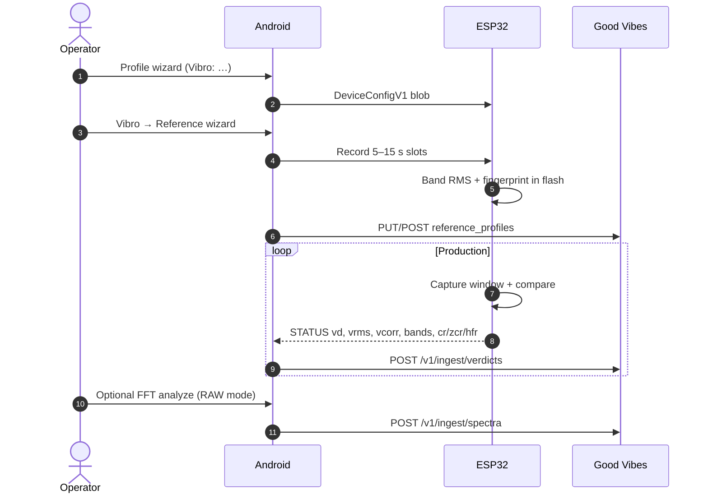
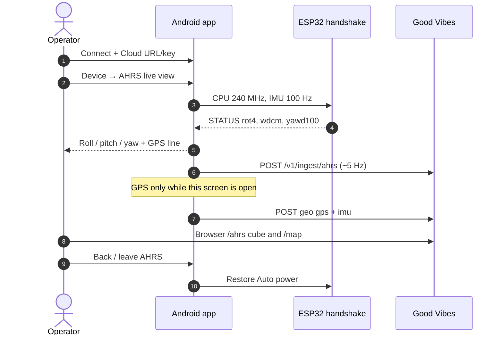
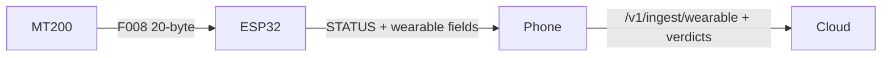
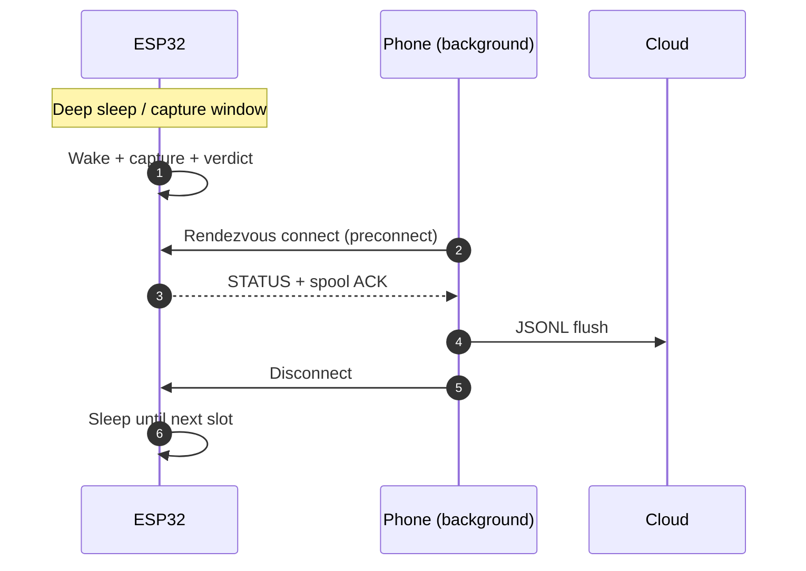
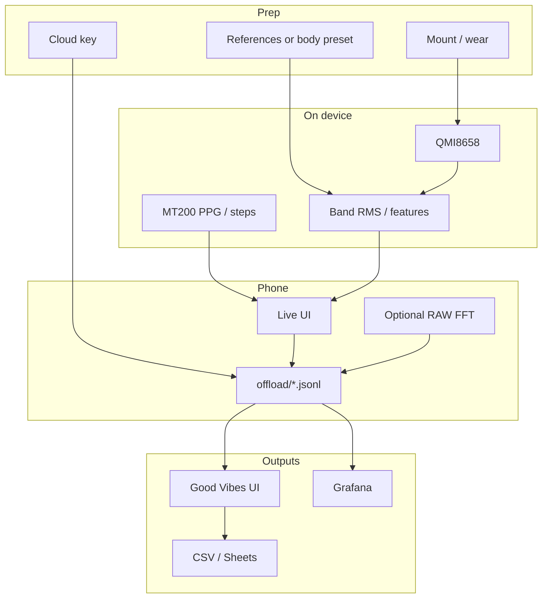

# Operator HOW-TO — ESP32-S3 IMU, phone, and MT200

## Contents

- [0. Read this first](#0-read-this-first)
  - [Topology cheat-sheet](#topology-cheat-sheet)
- [1. Shared prerequisites (every use case)](#1-shared-prerequisites-every-use-case)
  - [1.1 Hardware checklist](#11-hardware-checklist)
  - [1.2 First boot — board](#12-first-boot-board)
  - [1.3 First launch — phone](#13-first-launch-phone)
  - [1.4 Cloud (do this once if you want dashboards)](#14-cloud-do-this-once-if-you-want-dashboards)
  - [1.5 Where to look — three layers](#15-where-to-look-three-layers)
- [2. Body health measurements](#2-body-health-measurements)
  - [2.1 Variant A — ESP32 only (no watch)](#21-variant-a-esp32-only-no-watch)
  - [2.2 Variant B — ESP32 + MT200 (recommended for HR / SpO2)](#22-variant-b-esp32-mt200-recommended-for-hr-spo2)
  - [2.3 Preparations (body)](#23-preparations-body)
  - [2.4 Phone pipeline (body)](#24-phone-pipeline-body)
  - [2.5 Metrics — attention, dashboard, raw](#25-metrics-attention-dashboard-raw)
- [3. Vibration analysis (machines)](#3-vibration-analysis-machines)
  - [3.1 What you are actually measuring](#31-what-you-are-actually-measuring)
  - [3.2 Preparations (vibro)](#32-preparations-vibro)
  - [3.3 Phone pipeline (vibro)](#33-phone-pipeline-vibro)
  - [3.4 Metrics — attention, dashboard, raw](#34-metrics-attention-dashboard-raw)
- [4. Other operator workflows](#4-other-operator-workflows)
  - [4.1 Floor / mounting calibration](#41-floor-mounting-calibration)
  - [4.2 AHRS / orientation lab](#42-ahrs-orientation-lab)
  - [4.3 Battery bench](#43-battery-bench)
  - [4.4 WiFi wizard (provisioning only)](#44-wifi-wizard-provisioning-only)
  - [4.5 OTA (app then firmware)](#45-ota-app-then-firmware)
  - [4.6 Crash debug (lab)](#46-crash-debug-lab)
- [5. Topology deep-dive (FAQ of combinations)](#5-topology-deep-dive-faq-of-combinations)
  - [5.1 ESP32 + phone (no watch)](#51-esp32-phone-no-watch)
  - [5.2 ESP32 + MT200 + phone](#52-esp32-mt200-phone)
  - [5.3 MT200 + phone (no ESP32)](#53-mt200-phone-no-esp32)
  - [5.4 ESP32 + MT200, no phone](#54-esp32-mt200-no-phone)
  - [5.5 Two phones](#55-two-phones)
  - [5.6 Autopilot / rendezvous (unattended vibro)](#56-autopilot-rendezvous-unattended-vibro)
- [6. Data analysis — from prep to output](#6-data-analysis-from-prep-to-output)
- [7. Troubleshooting FAQ](#7-troubleshooting-faq)
- [8. Quick recipes](#8-quick-recipes)
- [9. File / URL index](#9-file-url-index)
- [Appendix: Acrylic status LED](#appendix-acrylic-status-led)

<!-- pdf:toc-end -->

**Audience:** field operator (not firmware developer).  
**Kit:** Waveshare **ESP32-S3-LCD-1.47B** (QMI8658 IMU), Android app **ESP32S3 IMU sim**, optional **Veepoo / H-Band MT200** watch, optional cloud **Good Vibes**.  
**Firmware on the board:** handshake (`handshake v189` at the time of writing). BLE name: `ESP32S3 IMU sim`.  
**Cloud (production):** `https://apps.f0xx.org/app/good_vibes`

This is the complete field FAQ: every supported topology, how to prepare hardware, how to tune the phone pipeline, and where each metric lives (app vs Grafana vs raw files).

---

## 0. Read this first

| Rule | Why |
|------|-----|
| The **phone never talks to the MT200**. Only the ESP32 can hold the watch link. | The watch is **single-LE-link**. H-Band XOR ESP32 XOR a laptop. |
| The **ESP32 never talks to Good Vibes by itself**. | WiFi STA is compiled **on** but lazy (wizard scan/connect, NTP). Cloud still goes through the phone. |
| **Raw IMU samples stay on the BLE link / phone UI.** Cloud stores **verdicts**, **wearable samples**, **spectra (on demand)**, **crashes**, **battery bench**. | Bandwidth and flash. |
| Glue the **board**, not a flying wire to the IMU. The QMI8658 is on the PCB (I2C SDA 48 / SCL 47). | You measure whatever mechanical path reaches that chip. |
| After moving the sensor to a new machine, **re-run the reference wizard**. | Old “healthy” fingerprints become false ALERTs. |

### Topology cheat-sheet

| Case | Hardware | Our app? | What you get |
|------|----------|----------|----------------|
| **A** ESP32 + phone | Board + Android | Yes | Live IMU, steps/walk, vibro, AHRS, cloud relay |
| **B** ESP32 + MT200 + phone | Board + watch + Android | Yes | Case A **plus** HR / SpO2 / steps from the watch, hop RSSI |
| **C** MT200 + phone only | Watch + H-Band | **No** | Use the vendor **H Band** app. ESP32S3ImuSim cannot pair the watch. |
| **D** ESP32 alone | Board, no phone | Limited | LCD scene, RGB LED, local verdicts; **no cloud**, no watch (bridge needs the debug build, still no HTTP) |
| **E** ESP32 + WiFi (no phone) | Board + AP | Limited | STA via **Device… → WiFi wizard** (BLE provision). NTP can run; **no cloud** without the phone. |

```mermaid
flowchart TB
  subgraph kit [Field kit]
    W[MT200 watch]
    E["ESP32-S3 board<br/>QMI8658 + LCD"]
    P["Android phone<br/>ESP32S3 IMU sim"]
  end
  subgraph cloud [Good Vibes]
    API[FastAPI ingest]
    DB[(TimescaleDB)]
    GV[Web UI]
    GR[Grafana]
  end
  W -. BLE central .-> E
  E -->|"BLE GATT IMU / Config / OTA"| P
  P -- HTTPS verdicts / wearable / spectra --> API
  API --> DB
  DB --> GV
  DB --> GR
```

---

## 1. Shared prerequisites (every use case)

### 1.1 Hardware checklist

1. Board charged or on USB-C (USB is fine for setup; **unplug USB** for battery-life or vibro-on-machine work).
2. Phone: Bluetooth on, location permission allowed (Android BLE scan), notification permission for the foreground relay.
3. App installed: package `com.esp32s3.imusim`. Test phone in this project is BL6000Pro; any Android 8+ works.
4. Optional watch: MT200 charged, **H Band force-stopped and Bluetooth disconnected from the watch**. If H-Band holds the link, the ESP32 cannot connect.

### 1.2 First boot — board

1. USB-C to a PC if you need a console; otherwise just power the battery.
2. LCD should show the handshake scene (horizon / live IMU). Serial (115200) should contain `handshake vNN`, `crash ring ready`, `BOOT armed (released=1)`.
3. BLE advertising name: **ESP32S3 IMU sim**.
4. Acrylic edge LED (WS2812 on GPIO38) shows setup / arm / fault / battery — see [Appendix: Acrylic status LED](#appendix-acrylic-status-led).

### 1.3 First launch — phone

1. Open **ESP32S3 IMU sim**.
2. Grant Bluetooth / nearby devices / notifications when asked.
3. Tap **Connect**. Wait until the status line shows connected (not “Disconnected”).
4. Leave the app in the background if you want the **autopilot relay** (periodic BLE sync). Foreground gives the live scene.

### 1.4 Cloud (do this once if you want dashboards)

1. **Device… → Cloud**.
2. URL: `https://apps.f0xx.org/app/good_vibes` (default).
3. Paste the API key (or **Import from clipboard** / setup link).
4. Device ID: leave default or set a stable name per board (Grafana filters on this).
5. Group ID: e.g. `press-1`, `body-lab`.
6. **Test connection**, then **Upload now** after you have data.
7. Bridge mode: leave **Rendezvous** unless you are lab-debugging (then shorter interval).

```mermaid
sequenceDiagram
  autonumber
  actor Op as Operator
  participant Board as ESP32 handshake
  participant Phone as Android app
  participant Cloud as Good Vibes
  Op->>Board: Power / USB
  Board->>Board: IMU + LCD + BLE advertise
  Op->>Phone: Connect
  Phone->>Board: GATT connect + CCC notify
  Board-->>Phone: STATUS + IMU batches
  Op->>Phone: Cloud URL + API key
  Phone->>Cloud: POST /v1/ingest/… (queued JSONL)
  Cloud-->>Op: Web UI + Grafana
```

### 1.5 Where to look — three layers

| Layer | What it is | When to use |
|-------|------------|-------------|
| **Phone UI** | Live scene, vibro caption, banners | Tuning, “is it alive?” |
| **Good Vibes web** | `…/app/good_vibes/` verdicts; `…/wearable` HR/steps; `…/ahrs` cube; `…/map` GPS vs IMU | Shift overview, AHRS lab, CSV/TSV export |
| **Grafana** | Verdicts, wearable, crashes, battery bench | Trends, lag, RSSI, edge features |

Production Grafana (behind the same host): `https://apps.f0xx.org/app/good_vibes/grafana/`

| Dashboard | UID | Use |
|-----------|-----|-----|
| ESP32 IMU Verdicts | `imu-verdicts` | RMS, corr, bands, edge, battery, ingest lag |
| Wearable (MT200) | `imu-wearable` | HR, SpO2, steps, walk_cm, hop RSSI, silent gaps |
| ESP32 IMU Crashes | `imu-crashes` | Fault ring uploads |
| Battery bench | `imu-battery-bench` | Discharge sessions |

---

## 2. Body health measurements

Two hardware variants. Software path is the same on the phone; the watch only adds PPG / step counter samples.

### 2.1 Variant A — ESP32 only (no watch)

**What the board measures:** 6-axis IMU (accel + gyro). Firmware derives **walk distance / steps-like walk_cm**, attitude, and live scene. There is **no optical HR or SpO2** on the ESP32.

**What you watch for:** motion, gait/walk_cm, orientation, battery, chip temperature.

### 2.2 Variant B — ESP32 + MT200 (recommended for HR / SpO2)

**What the watch measures:** heart rate, SpO2 (time-sliced vs HR), on-watch step counter, kcal, distance, watch battery.  
**What the ESP32 adds:** IMU walk_cm, BLE RSSI of the watch hop, relay to the phone.

**Hard rules**

- Wear the watch **snug, optical window on skin**. Table / no contact → HR stays `0` for ~30 s then still 0 (not a firmware bug).
- HR lock takes **~30 s** on-wrist (`D0` frames). SpO2 is **mutually exclusive with HR** (shared PPG). Firmware cycles them; do not expect both at 1 Hz.
- **Quit H Band** completely before powering the ESP32 bridge.
- Wrist RSSI is often −70 dBm on a table and −80…−86 dBm on-wrist. First connect can fail with RF noise; the bridge retries.

Current handshake merges crash-debug extras by default (`CRASH_DEBUG=1`), which **includes the MT200 central bridge** and autostart after BLE is up.

```mermaid
sequenceDiagram
  autonumber
  participant Watch as MT200
  participant ESP as ESP32 (BLE central + peripheral)
  participant Phone as Android
  participant Cloud as Good Vibes
  Note over Watch: H-Band must be off
  ESP->>Watch: Scan + GATT (F008)
  ESP->>Watch: F1 20 g-sensor + D0 01 HR; D8 sport poll; SpO2 window ~every 60s
  Watch-->>ESP: 20-byte notifies
  ESP-->>Phone: STATUS wok, HR, SpO2, steps, RSSI
  Phone-->>Phone: Live wearable caption
  Phone->>Cloud: POST /v1/ingest/wearable
  Phone->>Cloud: POST telemetry / walk_cm
```

### 2.3 Preparations (body)

1. Charge board + watch. Confirm LCD alive.
2. Strap the board so the **IMU chip side** is toward the body segment you care about (waist / ankle / chest pack). Avoid a floppy lanyard — the QMI8658 will report strap bounce as motion.
3. Optional: **Device… → Floor level calibration** on a known-level table if you care about tilt, not if the board is worn loosely.
4. Phone: Connect BLE.
5. **Device… → Profile wizard** → **Body sensor (computed)** (live IMU + steps, performance power) **or** **Body sensor (scene mirror)** if you want the LCD/scene mode mirrored.
6. Cloud as in §1.4. Group ID e.g. `body`.
7. For watch: put MT200 on wrist, kill H-Band, wait ~1 min after ESP boot for HR lock.

### 2.4 Phone pipeline (body)

| Step | Menu / control | Setting |
|------|----------------|---------|
| 1 | Main **Connect** | Stay connected or rely on autopilot |
| 2 | Mode chips | **Computed IMU** for gait/steps; **Angles / scene** to watch the LCD horizon |
| 3 | Profile wizard | Body computed / body scene |
| 4 | Cloud | Enabled, device_id unique per wearer or per board |
| 5 | Do **not** open Vibro reference wizard | That path is for machines |
| 6 | Optional **AHRS live view** | Full CPU 240 MHz + 100 Hz IMU — **not** a battery saver; yaw drifts (no magnetometer) |

### 2.5 Metrics — attention, dashboard, raw

| Metric | Meaning | Healthy-ish | Phone | Dashboard | Raw |
|--------|---------|-------------|-------|-----------|-----|
| HR | Optical bpm | 40–180 locked; 0 = no lock | Wearable live page after upload | Grafana **Wearable** | `wearable_samples` kind=`hr` |
| SpO2 | % | 95–100 on-wrist; `1` on wire = wear fail, not 1% | Wearable page | Grafana Wearable | kind=`spo2` |
| Watch steps | Watch pedometer | Monotonic during walk | Wearable page | Grafana Wearable | kind=`steps` |
| Watch kcal | Sport-model kcal (D8) | Rises with activity | Wearable page | Grafana Wearable | kind=`kcal_x10` (÷10) |
| Watch distance | Sport-model metres | Independent of IMU walk_cm | Wearable page | Grafana Wearable | kind=`distance_mm` (÷1000) |
| IMU `walk_cm` | Board integrated walk | Rises when the **board** moves | STATUS / wearable page | Grafana Wearable (compare vs watch steps) | kind=`walk_cm` |
| ESP↔phone RSSI | Phone-measured | Roughly −40…−80 indoor | STATUS | Wearable RSSI panels | ingest rssi fields |
| MT200↔ESP RSSI | ESP-measured | −70 table, worse on wrist; −127 = N/A | STATUS | Wearable hop RSSI | `mt200` rssi |
| Battery % / V | Board LiPo | Trend down off USB | Main caption | Verdicts + wearable | STATUS `pct`,`v` |
| Chip temp | SoC | Rises in AHRS / sun | STATUS | Verdicts | `tc` |

**Do not** treat IMU walk_cm and watch steps as the same counter. They disagree on purpose (different sensors). Use them as a **cross-check**: watch steps up + walk_cm flat ⇒ board isn’t on the walking limb.

**Live web:** `https://apps.f0xx.org/app/good_vibes/wearable`  
**CSV:** Good Vibes **Download CSV** / Copy TSV (delivery lag included on new ingest).

---

## 3. Vibration analysis (machines)

This is the industrial path: edge FFT / band RMS **on the ESP32**, phone as relay, cloud verdicts.

### 3.1 What you are actually measuring

The QMI8658 sits on the **PCB**, near the I2C header (SDA GPIO48, SCL GPIO47). You are **not** measuring a bearing race directly unless the mechanical path is stiff.

```mermaid
flowchart LR
  subgraph machine [Machine]
    R[Rotor / shaft]
    B[Bearing]
    H[Housing / stator frame]
  end
  subgraph board [ESP32-S3-LCD-1.47B]
    PCB[PCB + QMI8658]
  end
  R --> B --> H -->|glue / magnet / clamp| PCB
```

| Target | Where to glue / clamp | Axis hint |
|--------|----------------------|-----------|
| **Rolling bearing (radial)** | Bearing housing, load zone if known; else drive-end cap | Radial = across shaft; keep board flat on housing |
| **Thrust / axial** | Housing face along shaft centreline | IMU X/Y in the plane of the board; note which way the USB points and **write it on the machine** |
| **Rotor unbalance** | Rigid housing, **not** a guard sheet-metal | Same as radial bearing |
| **Stator / frame** | Motor foot or stator yoke, away from cooling fans that flap | Often lower frequency; use **Low RPM** or **Ultra-low RPM** preset |
| **Gearbox** | Split line or bearing cap, not the inspection cover | |
| **Pump / fan** | Pump volute or fan pillow block | Prefer **Intermittent** if the machine is not 24/7 |

**Mounting rules**

1. **Stiff path:** cyanoacrylate on a cleaned paint-free pad, or a strong magnet on a steel housing. Foam tape is for demos only (it low-pass-filters).
2. **One orientation forever** after the reference wizard. Rotating the board 90° invalidates fingerprints.
3. **Do not** mount on a vibrating cable tray or the plastic LCD bezel as the only contact — couple the **back of the PCB / metal can** to the machine.
4. LCD can face out for a glance; the IMU still needs the stiff path.
5. Keep USB cable off the machine while capturing (cable slap looks like an ALERT).

### 3.2 Preparations (vibro)

1. Machine in **normal idle / normal production** — not a crash-stop, not a cold start unless that *is* the reference.
2. Glue/clamp as above. Mark USB direction with a paint pen.
3. Phone BLE connect. Unplug USB from the board if you care about battery schedule / deep sleep.
4. **Device… → Profile wizard** — pick a vibro preset (table below).
5. **Vibro… → Reference wizard** on **this** mounting. Confirm erase if the sensor moved.
6. Cloud group_id = machine name. Device ID = this board.

### 3.3 Phone pipeline (vibro)

```mermaid
sequenceDiagram
  autonumber
  actor Op as Operator
  participant Phone as Android
  participant ESP as ESP32
  participant Cloud as Good Vibes
  Op->>Phone: Profile wizard (Vibro: …)
  Phone->>ESP: DeviceConfigV1 blob
  Op->>Phone: Vibro → Reference wizard
  Phone->>ESP: Record 5–15 s slots
  ESP->>ESP: Band RMS + fingerprint in flash
  Phone->>Cloud: PUT/POST reference_profiles
  loop Production
    ESP->>ESP: Capture window + compare
    ESP-->>Phone: STATUS vd, vrms, vcorr, bands, cr/zcr/hfr
    Phone->>Cloud: POST /v1/ingest/verdicts
  end
  Op->>Phone: Optional FFT analyze (RAW mode)
  Phone->>Cloud: POST /v1/ingest/spectra
```

| Preset (Profile wizard) | When | Capture idea |
|-------------------------|------|----------------|
| **Vibro: normal** | Typical 50/60 Hz machines, continuous | ~15 s window / 60 s interval, 100 Hz IMU |
| **Vibro: low RPM diagnosis** | Slow shafts, more time per rev | 30 s / 120 s, 50 Hz |
| **Vibro: ultra-low RPM** | Very slow / high inertia | 60 s / 5 min, 25 Hz |
| **Vibro: intermittent machine** | Starts/stops; save battery | Hourly random slot, deep sleep, mix windows |
| **Vibro: machine monitor (mix)** | Unattended monitor | Intermittent + mix/dyn sub-windows |

Then:

1. **Vibro… → Reference wizard…**  
   - Erase slots if this is a new machine.  
   - Choose 1–5 references (3 is a good default).  
   - Each take: **normal idle vibration ~12 s**, hold still relative to the housing (you are not “shaking” a turbine).  
   - **Upload & finish**.
2. **Vibro… → Repair / operator…** — attach this ESP as a **sensor** on a **machine**, then **START REPAIR** before mechanical work (CMD 14 pauses live persist; refs stay). After the job, **END REPAIR** and pick the FTA leaf (bearing / misalignment / cavitation / electrical / process / other). If the mechanical path changed, the app opens the reference wizard; process-only with the same mount can **Arm** and keep refs.
3. **Vibro… → Vibro mode** to switch diagnosis tier later without the full wizard.
4. **Vibro… → FFT analyze** switches the ESP to **Raw IMU**, collects a burst, uploads a 128-bin spectrum. Use when Grafana candidates look wrong and you want a picture of the line.
5. **Vibro… → Verdict history** — last on-phone **candidate** levels (`vd`), not the mechanic page.

A single window `vd=2` is a **candidate**, not a page. The backend pages the mechanic when **operator ALARM** fires (increasing trend, last K candidates ≥ WARN, score ≥ 0.6), excluding repair windows. Phone banner and Good Vibes **Machine / operator** show that page.

Acrylic LED (GPIO38): **off** when armed with refs loaded. A single WARN/ALERT window does **not** turn the pixel red. Red is still **armed without a loaded reference**. Colour chart: [Appendix: Acrylic status LED](#appendix-acrylic-status-led).

### 3.4 Metrics — attention, dashboard, raw

| Metric | Meaning | Attention | Phone | Dashboard | Raw |
|--------|---------|-----------|-------|-----------|-----|
| `vd` / `candidate_level` | Edge window 0/1/2 | Evidence only — never pages the mechanic | Caption `cand …` | Grafana **candidate** + Good Vibes table | `verdicts.level` |
| `operator_level` / `operator_alert` | Backend trend + confidence, repair gaps excluded | **Page the mechanic** on ALARM | Banner from `GET …/operator_status` | Good Vibes machine card + Grafana Operator | `operator_status` |
| `vrms` / `vpeak` | Time-domain energy | Step change after maintenance | Caption | Verdicts RMS panel | columns |
| `vcorr` / `bcorr` | Similarity to reference | Drop ⇒ spectral shape changed | Caption | band_corr panel | `raw_json` |
| `bdmax` | Worst band delta | Which band moved | Caption | band_delta_max | `raw_json` |
| `bnd[]` / `b16[]` | 4 band RMS | Compare to ref bands | — | band time series | `raw_json.bands` |
| `cr` crest | Peakiness | Impacts, looseness | Caption | edge_crest | `raw_json` |
| `zcr` | Zero-crossing rate | High-frequency hash | Caption | edge_zcr_hz | `raw_json` |
| `hfr` | High-frequency ratio | Bearing-ish vs 1× running speed | Caption | edge_hf_ratio | `raw_json` |
| `edge_score` / `edge_risk` | **Server** heuristic | Trend, not a trip | — | Verdicts | computed on ingest |
| Spectrum bins | Phone FFT of RAW | “What frequency?” | FFT toast | (API spectra) | `POST /v1/ingest/spectra` |
| LED | Local | Red = act now | Eyes | — | — |

**Live web:** `https://apps.f0xx.org/app/good_vibes/`  
**Do not** stare at live RAW IMU in Grafana — it is not stored. Use FFT upload or the phone scene.

**False candidate checklist:** loose glue, USB cable, reference taken while the machine was off, board rotated, nearby hammering, deep-sleep preset on a machine that should be continuous. A lone `vd=2` is not an operator ALARM — wait for trend, or open **Repair / operator** if you are already working on the machine.

---

## 4. Other operator workflows

These are **lab / setup tools**, not the daily body or vibro loops. Each subsection is a full operator pass: what it is, what to tap on the phone, how to know it worked.

Do **§1.3 Connect** first. Most of these menus refuse to open (or show “Connect to the ESP32 over BLE first”) until the status line is connected.

### 4.1 Floor / mounting calibration

**Device… → Floor level calibration…**

This is **not** the silent per-boot “keep still” gyro/accel zero, and **not** a vibration reference. Boot cal only removes sensor bias. Floor cal stores a **persistent tilt matrix**: “this enclosure sits a few degrees off true level — treat that as flat.” It survives reboot and is applied on top of boot cal.

**When to run it**

- The board is glued / clamped / in a case at a fixed angle and you want roll/pitch / the LCD horizon / AHRS to read **0° when the machine (or table) is level**.
- After you remount at a **new** angle — old correction is wrong; **Clear** then recapture.

**Skip it** when the board is worn loosely on a body (strap bounce is not a fixed mount) or you only care about vibration fingerprints.

**Phone pipeline**

| Step | Where | What you do |
|------|-------|-------------|
| 1 | Main **Connect** | Wait until connected |
| 2 | Optional | Put a **bubble level** on the same surface you will use as “true flat” |
| 3 | **Device… → Floor level calibration…** | Status should say **Not calibrated** or **Calibrated** (last residual) |
| 4 | Place the **board** on that surface, still | Confirm dialog, tap **Start calibration** |
| 5 | Hold still ~3 s | Banner “Floor calibration started”; progress bar fills |
| 6 | Done | Status **Calibrated**, line like `corrected 2.40° of mounting tilt` |

**How to check**

- Re-open the same screen after a reboot: it must still say **Calibrated** (flash-backed).
- Open **AHRS** (§4.2) or the main **Angles / scene** chip: sitting on that same surface, roll/pitch should sit near 0°. If they sit at a constant offset, you calibrated on a surface that was not actually level — **Clear** and redo next to a bubble.
- **Clear calibration** only when you remount or the residual looks insane (>15° on a table you know is flat usually means the board moved during the window).

### 4.2 AHRS / orientation lab

**What this is (new user, 30 seconds)**

AHRS = *attitude and heading reference*: the ESP32 runs **Madgwick** fusion (gyro + accelerometer) into **roll, pitch, yaw** and a 3×3 rotation matrix (`rot4` on BLE). There is **no magnetometer**, so **yaw slowly drifts** when you stand still — that is expected, not a broken board.

The phone screen is a **live lab readout** (numbers + GPS). The **3D cube** lives in the browser. A **map** can overlay phone GPS vs IMU dead-reckoning while this screen stays open.

Opening this screen **forces 240 MHz CPU + 100 Hz IMU**. Leave it (back to the main screen) to restore Auto. Do not leave it up overnight on battery.

```mermaid
sequenceDiagram
  autonumber
  actor Op as Operator
  participant Phone as Android app
  participant ESP as ESP32 handshake
  participant Cloud as Good Vibes
  Op->>Phone: Connect + Cloud URL/key
  Op->>Phone: Device → AHRS live view
  Phone->>ESP: CPU 240 MHz, IMU 100 Hz
  ESP-->>Phone: STATUS rot4, wdcm, yawd100
  Phone-->>Op: Roll / pitch / yaw + GPS line
  Phone->>Cloud: POST /v1/ingest/ahrs (~5 Hz)
  Note over Phone: GPS only while this screen is open
  Phone->>Cloud: POST geo gps + imu
  Op->>Cloud: Browser /ahrs cube and /map
  Op->>Phone: Back / leave AHRS
  Phone->>ESP: Restore Auto power
```

#### What to set up in the mobile app

| Step | Menu / control | Setting |
|------|----------------|---------|
| 1 | Main **Connect** | Stay connected. AHRS will not open until BLE is up. |
| 2 | **Device… → Cloud** | Enable cloud. URL `https://apps.f0xx.org/app/good_vibes`. Paste API key (or **Import from clipboard**). **Device ID** = a stable name you will type on the web page. **Test connection**. |
| 3 | Android **Location** | Allow for this app. GPS and the map path run **only** on the AHRS screen. |
| 4 | Optional **Device… → Floor level calibration…** | §4.1 — do this *before* AHRS if you want “table = 0°”. |
| 5 | Optional **Device… → Profile wizard** | **Body sensor (computed)** or **Body sensor (scene mirror)** is fine. Vibro presets are unused here. |
| 6 | **Device… → AHRS live view (full speed)…** | Status goes **Boosting…** then **Live (240 MHz / 100 Hz)**. |

You do **not** need the MT200 watch. You do **not** run the vibro reference wizard.

#### How to check (phone)

1. Status line is **Live (240 MHz / 100 Hz)**, not **No data yet** or **Connect to the ESP32…**.
2. Readout shows **Roll / Pitch / Yaw** updating a few times per second. Yaw also prints `(ESP n.n°)` from firmware (`yawd100`).
3. **Tilt test:** pitch the USB end up — **pitch** should move several degrees and settle when you hold still. Roll the board onto its long edge — **roll** moves. Accel pulls roll/pitch back to gravity; they must not keep spinning on a still table.
4. **Yaw test:** rotate the board on the table like a compass. Yaw should follow. Put it down: yaw may creep ~1° every few seconds. That is no-mag drift, not a failed gyro cal. A **steady spin of many degrees per second while the board is still** is a failed boot gyro zero — leave the board still, reboot, wait for `Gyro calibration OK` on serial (or just power-cycle and don’t touch it for ~3 s).
5. GPS panel: after a few seconds outdoors (or near a window) you want `GPS: lat, lon ±N m` and, if cloud is on, `uploaded ok`. `GPS: permission denied` → Android settings. `cloud off` → §1.4. `IMU geo: waiting for first GPS + walk_cm` until the first fix; then walk a few metres and `walk` / `imu pts` should rise.
6. Leave the screen (toolbar back). Chip temp and battery drain should drop; IMU rate returns to the profile default.

#### How to check (web cube + map)

Keep the phone on the AHRS screen (or at least BLE connected with cloud on — the cube relay is in the BLE service). On a laptop:

| Check | URL | What “good” looks like |
|-------|-----|------------------------|
| 3D cube | `https://apps.f0xx.org/app/good_vibes/ahrs` | Paste the **same API key** and **same Device ID** as the phone. Cube rotates when you tilt the board; X=red (roll), Y=green (pitch), Z=blue (yaw/up). |
| Route map | `https://apps.f0xx.org/app/good_vibes/map` | **AHRS screen stays open** (GPS). Walk a short loop. Green = phone GPS, red = IMU dead-reckon from the **first GPS** + `wdcm` + gyro yaw. Layers can be toggled. |

Dashboard home also links both: `https://apps.f0xx.org/app/good_vibes/` → **AHRS debug** / **GPS + IMU route**.

AHRS samples are **live in the backend process** (best-effort, no retry). A backend recreate / restart wipes the in-memory cube until the phone sends the next samples. Failed geo POSTs spool to the phone file `offload/geo.jsonl`.

#### Limits operators ask about

| Topic | Fact |
|-------|------|
| Compass heading | **No.** ESP uses Madgwick (accel+gyro); yaw is still gyro-only with no magnetometer. Do not navigate by it after a minute of standing still. |
| Altitude | **No** baro on the ESP. Height on the AHRS screen is **phone GPS** only. |
| Power | This screen is the opposite of Auto. Use it to look, then leave. |
| Cube vs phone numbers | Same `rot4` from the ESP. If the cube is frozen but the phone is Live, the web page has the wrong key/device_id or cloud is off. |
| Map IMU vs GPS | IMU path starts at the **first GPS** of this AHRS session. Indoor GPS jump will offset the whole red trace. |

### 4.3 Battery bench

**Device… → Battery bench…**

Lab discharge curve: the ESP locks config and samples pack voltage at **1 Hz** while you run **on battery**. Cloud (when enabled) uploads the session; Grafana **Battery bench** plots it.

**Phone pipeline**

| Step | Where | What you do |
|------|-------|-------------|
| 1 | Board | Charge, then **unplug USB-C**. USB/DC makes the curve look flat at ~4.2 V. |
| 2 | Main **Connect** | BLE up |
| 3 | **Device… → Cloud** | Enable if you want Grafana (same key/device_id as always) |
| 4 | **Device… → Battery bench…** | Optional session label (e.g. `dc-full-scene`) |
| 5 | **Start bench** | Confirm. Banner “unplug USB for accurate discharge”. Status **Bench running — config locked**. |
| 6 | Run the scenario | Typical: LCD on, BLE connected, Auto or a known profile. Note what you did. |
| 7 | **Stop bench** | Unlocks config. **Upload pending samples** if cloud was off during the run. |

**How to check**

- Phone: `pending upload: N` goes to 0 after **Upload** / autopilot flush.
- Grafana **Battery bench** (`imu-battery-bench`): a new session_id, voltage trending down off USB, not a flat 4.2 V line.
- You cannot change Profile / Config editor while the bench is running — that lock is the point. Stop first.

Do not start a bench on a machine you are about to capture vibration on; Stop first so config writes work again.

### 4.4 WiFi wizard (provisioning only)

**Device… → WiFi wizard**

The ESP **does not upload to Good Vibes by itself**. WiFi STA is for **NTP / clock** and lab connectivity. Cloud still goes through the phone. The menu appears only when STATUS `feat` includes WiFi (`CAP_WIFI`).

Talks **over BLE**. While the ESP WiFi radio is scanning or connecting, **IMU NOTIFY pauses** — the live scene may freeze; it returns when the radio is idle. If the phone will not accept a long LE interval, the ESP **drops the BLE link for the scan** (banner: BLE paused) and advertises again when the WiFi radio is released so the app can reconnect and read results.

**Phone pipeline (BLE scan — preferred)**

| Step | Where | What you do |
|------|-------|-------------|
| 1 | Main **Connect** | Required |
| 2 | **Device… → WiFi wizard** | Hub: scan / saved profiles / hotspot |
| 3 | **Scan nearby networks** | Wait; banner may say BLE paused |
| 4 | Tap the AP | Enter WPA2 password (empty if open) → **Connect / save** |
| 5 | **Saved profiles on ESP** | Later you can activate or delete without re-typing |

**Setup hotspot (if scan fails)**

1. Hub → **Open setup hotspot (keep profiles)** (or **erase profiles** if you want a clean slate).
2. On the **same** phone/tablet: Android Settings → WiFi → join **`ESP32-IMU-Setup`** / password **`imu12345`**.
3. Open `http://192.168.4.1` if the captive page does not appear. Enter the building AP there.
4. BLE can stay up for status; the phone’s own WAN is on the ESP hotspot until you leave that AP.

**How to check**

- Wizard / STATUS: STA associated, not looping scan.
- Serial: NTP / clock sync after the boot delay (not instant).
- Good Vibes still empty until the **phone** has WAN + Cloud enabled — WiFi on the ESP does not replace §1.4.

### 4.5 OTA (app then firmware)

Two independent version counters (app and firmware), both advertised on the Good Vibes CDN — **not** Android Cast `/v0/ota/`. Full sequence (cloud builder, GATT, A/B, Insights OK/NOK): **[zephyr-ota.md](zephyr-ota.md)**.

**Phone pipeline**

| Step | Where | What you do |
|------|-------|-------------|
| 1 | Main **Connect** | Needed for firmware OTA. APK can download without the board. |
| 2 | **Device… → Check for OTA** | Fetches `https://cdn.f0xx.org/good_vibes/v0/ota/channel/stable.json` (retries `cdn0`–`cdn2`) |
| 3 | Prompt **App update** | **Install** first. Allow unknown sources for this app if Android asks. |
| 4 | Re-open app, Connect, **Check for OTA** again | Prompt **ESP32 firmware update** (shows current `handshake vNN`) |
| 5 | Keep the phone near the board | Do not kill the app mid-transfer. After 99% the phone shows **restarting** and must **reconnect** so A/B can confirm. Do not reset the ESP. |

**How to check**

- Phone: after APK install, app version name on the main/about or `adb shell dumpsys package com.esp32s3.imusim | grep versionName`.
- After FW OTA: stay connected ~10 s. STATUS / caption shows the **cloud** name (`00.0001.0000.NNNNN`), not desk `handshake vNN`. Serial: `crash ring ready`, that `fw` string, `BOOT armed (released=1)`. Insights OTA card is a **crash-ring** `fw_upgrade` row — it appears only after that reconnect + drain. If you reset before confirm, McUboot **reverts** and you are back on the previous slot (`handshake vNN` after a USB factory image).
- Phone **refuses firmware** if the APK is older than the channel’s `min_apk_versionCode` — that is why APK is first.
- **Later** on a prompt just defers; **Check for OTA** again when you are ready.
- **Device… → OTA from file** is the USB-less lab path (pick a `.bin` / MCUboot image). Recovery if BLE OTA fails: USB `zephyr/scripts/flash-zephyr.sh handshake`.

### 4.6 Crash debug (lab)

**Device… → Crash debug (dev)…**

Only useful on images with crash-debug extras (`dbg=1` / `CRASH_DEBUG`). Production machine captures: **do not inject**.

**Phone pipeline**

| Step | Where | What you do |
|------|-------|-------------|
| 1 | Main **Connect** | Status on this screen: **Debug firmware ready (dbg=1)** |
| 2 | Optional **Run BIST** | Self-test; check serial / STATUS `bist` — does not reboot |
| 3 | **Inject & reboot** | Pick a fault, confirm. ESP resets immediately |
| 4 | Stay in range | Autopilot / next BLE session drains the crash ring and uploads |

**How to check**

- Serial after inject: crash ring slot pending, then a clean `handshake vNN` boot.
- Grafana **ESP32 IMU Crashes** (`imu-crashes`): new row for this device_id, reason matching the inject.
- Good Vibes does not need a special “crash page” — the phone relay is enough if Cloud is on.

Do not use inject to “test the LED” on a board that is mid reference-wizard or battery bench.

---

## 5. Topology deep-dive (FAQ of combinations)

### 5.1 ESP32 + phone (no watch)

```mermaid
flowchart LR
  E[ESP32] -->|GATT STATUS + IMU| P[Phone]
  P -->|verdicts / spectra / crashes| C[Cloud]
```

**Use:** body IMU, vibration, AHRS, battery bench.  
**You will not see:** HR, SpO2, watch steps. Wearable page may still show `walk_cm` from the IMU.

### 5.2 ESP32 + MT200 + phone

```mermaid
flowchart LR
  W[MT200] -->|F008 20-byte| E[ESP32]
  E -->|STATUS + wearable fields| P[Phone]
  P -->|/v1/ingest/wearable + verdicts| C[Cloud]
```

**Use:** body health with optical sensors **and** optional vibro if the board is also on a machine (unusual — pick one mounting).  
**Setup extra:** H-Band off; wait for HR lock; compare watch steps vs `walk_cm`.

### 5.3 MT200 + phone (no ESP32)

**Not supported by ESP32S3 IMU sim.** Use **H Band**. Our cloud never sees those samples unless some other bridge exists.

### 5.4 ESP32 + MT200, no phone

Watch samples sit in ESP RAM/STATUS only. **No Good Vibes**. LCD will not show a medical dashboard. Bring a phone for ingest.

### 5.5 Two phones

Only one BLE central should hold the ESP32. A second phone can open Good Vibes in a browser (cloud), not a second BLE connection.

### 5.6 Autopilot / rendezvous (unattended vibro)

Phone in a locker near the machine:

1. Cloud on, bridge **Rendezvous**.
2. Intermittent / machine-monitor preset so the ESP sleeps between windows.
3. Phone must stay powered and in BLE range. WorkManager uploads when the WAN is up.

```mermaid
sequenceDiagram
  autonumber
  participant ESP as ESP32
  participant Phone as Phone (background)
  participant Cloud as Cloud
  Note over ESP: Deep sleep / capture window
  ESP->>ESP: Wake + capture + verdict
  Phone->>ESP: Rendezvous connect (preconnect)
  ESP-->>Phone: STATUS + spool ACK
  Phone->>Cloud: JSONL flush
  Phone->>ESP: Disconnect
  ESP->>ESP: Sleep until next slot
```

---

## 6. Data analysis — from prep to output

```mermaid
flowchart TB
  subgraph prep [Prep]
    M[Mount / wear]
    R[References or body preset]
    K[Cloud key]
  end
  subgraph edge [On device]
    IMU[QMI8658]
    FFT[Band RMS / features]
    W[MT200 PPG / steps]
  end
  subgraph phone [Phone]
    UI[Live UI]
    Q[offload/*.jsonl]
    FFTP[Optional RAW FFT]
  end
  subgraph out [Outputs]
    GV[Good Vibes UI]
    GR[Grafana]
    CSV[CSV / Sheets]
  end
  M --> IMU
  R --> FFT
  IMU --> FFT
  W --> UI
  FFT --> UI
  K --> Q
  UI --> Q
  FFTP --> Q
  Q --> GV --> CSV
  Q --> GR
```

**Recommended daily loop**

1. Grafana Wearable or Verdicts — last 24 h, look for **holes** (relay down) vs **ALERT clusters** (real process).
2. Good Vibes table — CSV if you need Sheets.
3. Phone only when Grafana is ambiguous (FFT, ref wizard, LED).

**Export:** Good Vibes **Download CSV** joins wearable + telemetry + verdicts + ingest batches (`lag_ms`, RSSI, bytes). Historical rows may have empty `delivered_at` until new ingest.

---

## 7. Troubleshooting FAQ

**Connect button does nothing / scan empty**  
Bluetooth + location permission; board advertising; another phone already connected.

**Connected but no IMU**  
Wait 2 s for CCC; reboot board; confirm handshake not `smoke` firmware (`WS147B-Zephyr` is smoke-only).

**Watch never locks HR**  
H-Band still connected; watch not on skin; wait 30+ s; RSSI −90 or −127; crash-debug/MT200 not in this image (`CRASH_DEBUG=0`).

**SpO2 is 1%**  
Wear-fail flag, not saturation. Tighten strap. Stop expecting HR in the same second.

**ALERT with a quiet machine**  
Bad or empty references; mount loose; USB cable; board moved. Re-wizard.

**Grafana empty, phone live**  
Cloud key/URL; **Upload now**; WAN; device_id mismatch vs Grafana variable.

**Two data holes: wearable vs verdicts**  
Different pipelines. Wearable is fire-and-forget; verdicts retry via JSONL. A quiet STATUS does not mean the watch ingest died.

**AHRS says No data yet / cube frozen**  
BLE not connected; or cloud off / wrong Device ID / wrong API key on `…/ahrs`. Phone must show **Live (240 MHz / 100 Hz)**. Backend restart clears the in-memory cube until the next samples.

**AHRS yaw creeps while the board sits still**  
Expected (no magnetometer). A fast continuous spin on a still table is a bad boot gyro zero — power-cycle and do not touch the board for a few seconds.

**OTA offered forever**  
Phone APK still older than manifest `min_apk_versionCode`, or FW_VERSION_CODE not bumped on the image you flashed.

**Cast builder vs IMU builder (lab)**  
Android Cast and IMU are **separate tenants**. IMU jobs must show project `imu`, containers `imu-bld-*` / `imu-zephyr-bld-*`, DB channel `imu` (publishes `good_vibes/…/stable.json`). Never `androidcast-bld-*`, never Cast path `/v0/ota/` without the `good_vibes` prefix. Cloud app/fw versions start at `00.0001.0000.00001` on **separate** counters. See `ci/cast/README.md`.

**What does the acrylic LED colour mean? (board status / readiness)**  
Single WS2812 on GPIO38. ✓ = that RGB channel is on. Empty = off. `*reserved*` = that colour combo is not wired. Flash is 2 s on / 2 s off. Healthy armed run is **off**. Full date/FW wiring: [Appendix: Acrylic status LED](#appendix-acrylic-status-led).

| Condition | R | G | B |
|-----------|---|---|---|
| Setup — no reference profiles (solid blue) | | | ✓ |
| Await arm — refs recorded, not started (blue flash 2s/2s) | | | ✓ |
| OK pulse — NVS/config saved (~2 s solid green) | | ✓ | |
| NOK — armed without loaded ref (solid red) | ✓ | | |
| Battery ≤10% SOC on battery, not USB/DC (yellow flash 2s/2s) | ✓ | ✓ | |
| Operational — armed, refs OK, no fault (off) | | | |
| Magenta (R+B) | *reserved* | *reserved* | *reserved* |
| Cyan (G+B) | *reserved* | *reserved* | *reserved* |
| White (R+G+B) | *reserved* | *reserved* | *reserved* |

---

## 8. Quick recipes

**Body + watch, 10 minutes**  
Kill H-Band → power ESP → Connect phone → Profile **Body sensor (computed)** → Cloud on → wear watch → wait for HR → open `/wearable`.

**New pump, 20 minutes**  
Glue on bearing cap → Connect → Profile **Vibro: normal** → **Repair / operator** create machine + attach sensor → Reference wizard ×3 at idle → Arm → Cloud group `pump-7` → confirm LED **off** after arm → Good Vibes machine card (operator), Grafana candidates. After a bearing/seal/remount job: START REPAIR → work → END REPAIR (leaf) → re-wizard if `new_ref_required`.

**Overnight unattended**  
Intermittent or machine-monitor preset → Rendezvous bridge → phone plugged in BLE range → morning Grafana + CSV.

**AHRS cube + short walk, 5 minutes**  
Connect → Cloud on (remember device_id) → optional Floor level cal on a bubble-level table → **AHRS live view** → confirm Live + tilt test → laptop `…/ahrs` (same key + id) → walk with AHRS still open → `…/map` → leave AHRS to restore Auto.

---

## 9. File / URL index

| Thing | Where |
|-------|--------|
| App package | `com.esp32s3.imusim` |
| BLE name | `ESP32S3 IMU sim` |
| Cloud | `https://apps.f0xx.org/app/good_vibes` |
| Wearable UI | `…/wearable` |
| AHRS cube | `…/ahrs` |
| GPS + IMU map | `…/map` |
| Grafana | `…/grafana/` |
| Phone queue | app files `offload/verdicts.jsonl` (+ gzip) |
| Firmware flash | `zephyr/scripts/flash-zephyr.sh handshake` |
| Acrylic LED colours | [Appendix: Acrylic status LED](#appendix-acrylic-status-led) |
| MT200 protocol notes | [veepoo-proto-ble-reverse.md](veepoo-proto-ble-reverse.md) |
| Metrics schema | [metrics.md](metrics.md) |
| Architecture | [architecture.md](architecture.md) |

---

## Appendix: Acrylic status LED

**Wired:** 2026-08-30 (handshake `vibro_led.c`, `handshake v186`). Per-window `vd` no longer drives red.  
**Pixel:** single WS2812 on **GPIO38**, **RGB** wire order (bench: v183 GRB swapped R↔G). Channel drive 48/255.

GPIO38 is driven by the ESP32-S3 **RMT** peripheral (Arduino timings: 10 MHz, 0-bit 0.4/0.8 µs, 1-bit 0.8/0.4 µs). Crash debug LED mapping holds the TFT backlight off (scene still renders) so only the pixel lights the acrylic.

**Solid vs flash.** Solid means the channel stays on. Flash is 2 s on / 2 s off. The OK pulse is a **solid ~2 s** burst, then the base state returns.

**Priority** (first match wins): OK pulse → battery critical → setup (no refs) → await arm → NOK → off.

✓ = that RGB channel is driven. Empty = channel off.

| Condition | R | G | B | Looks like |
|-----------|---|---|---|------------|
| Setup — no reference profiles (solid) | | | ✓ | blue |
| Await arm — refs recorded, not started / CMD 10 (flash 2s/2s) | | | ✓ | blue ↔ off |
| OK pulse — NVS / config saved (~2 s) | | ✓ | | green |
| NOK — armed without a loaded reference | ✓ | | | red |
| Battery critical — ≤10% SOC **and** on battery, not USB/DC (flash) | ✓ | ✓ | | yellow ↔ off |
| Operational — armed, refs OK, no active fault | | | | off |

**Not a colour in this table.** BLE advertising, BLE connected, charging / on USB, OTA, crash, MT200 watch link, and WiFi do **not** set the acrylic LED. Charging specifically suppresses the yellow battery flash (`on_dc` → not critical). Smoke firmware (`WS147B-Zephyr`) only turns the pixel off; it does not use this schema.
