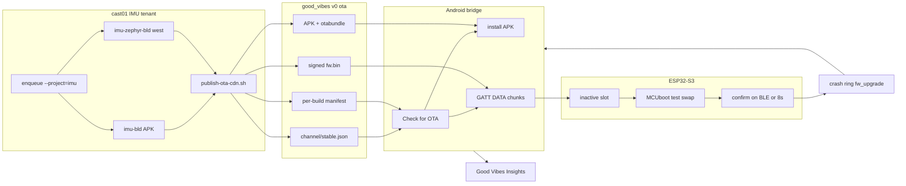
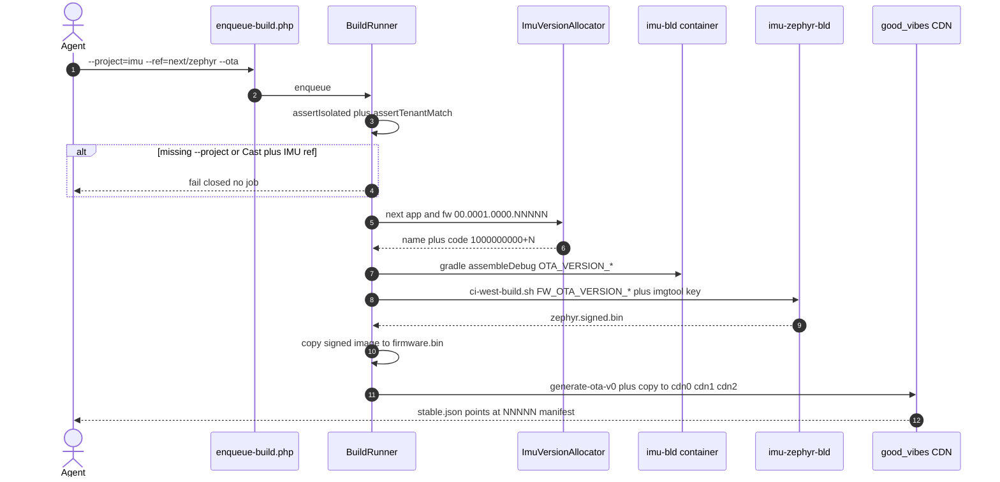
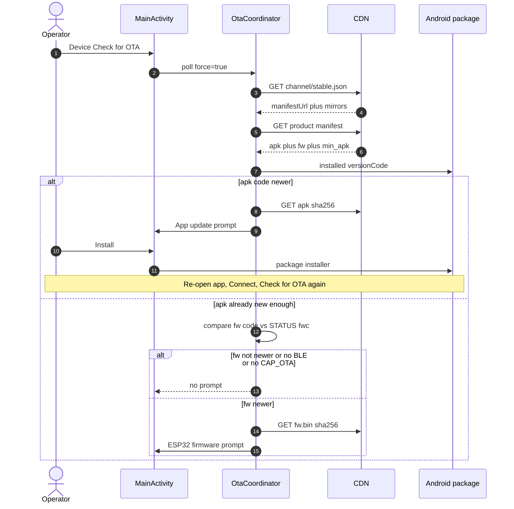
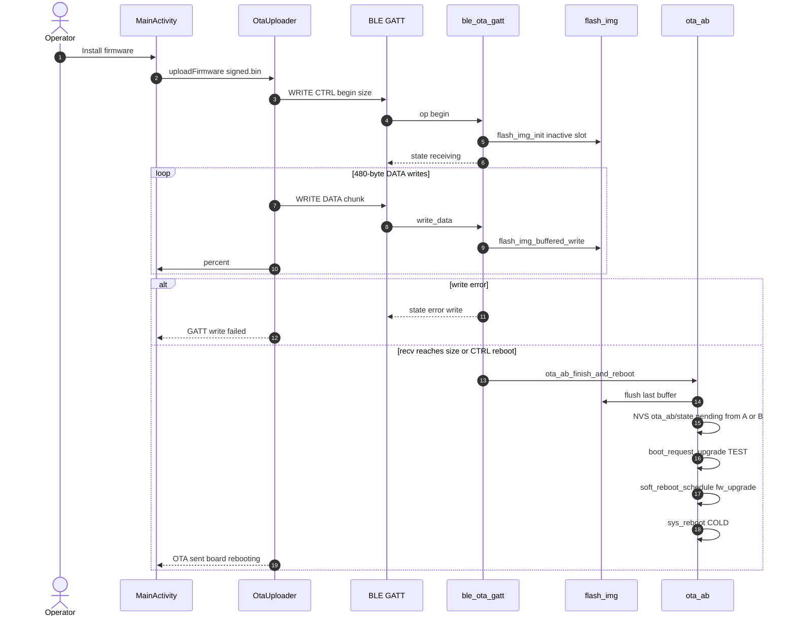
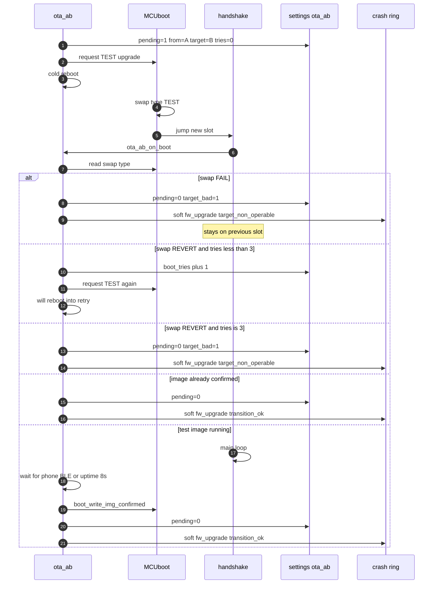
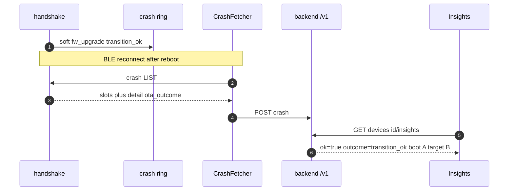
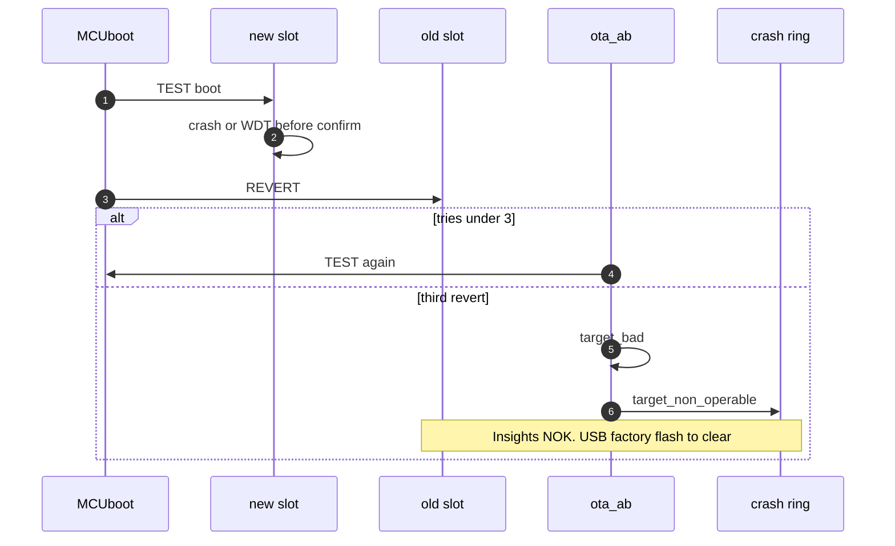
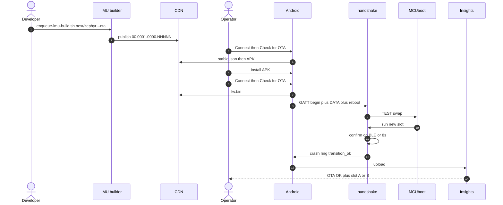

# Zephyr OTA — cloud, phone bridge, A/B

## Contents

- [Actors and stores](#actors-and-stores)
- [Version lines (do not mix)](#version-lines-do-not-mix)
- [1. Cloud: enqueue, build, publish](#1-cloud-enqueue-build-publish)
- [2. Phone: poll CDN, APK first, then firmware](#2-phone-poll-cdn-apk-first-then-firmware)
- [3. Phone as BLE bridge (no USB)](#3-phone-as-ble-bridge-no-usb)
- [4. A/B flash and confirm](#4-ab-flash-and-confirm)
- [5. Success feedback](#5-success-feedback)
- [6. Failure feedback and recovery](#6-failure-feedback-and-recovery)
- [7. End-to-end happy path](#7-end-to-end-happy-path)
- [Operator checklist](#operator-checklist)
- [Source map](#source-map)

<!-- pdf:toc-end -->

How Good Vibes firmware moves from the IMU cloud builder onto the ESP32-S3: the phone is
normally a **BLE bridge**. Preferred CDN channel (`stable` / `staging` / `dev`, default
**stable**) is synced phone→ESP for STATUS/`fw_upgrade` reporting. WiFi HTTPS self-pull is
compiled out by default (TLS blew DRAM and hung boards). Android Cast `/v0/ota/` is a
different product and must not appear in this path.

Field button-push: [operator-howto.md](operator-howto.md) §4.5. Track switching:
[dual-firmware-probing.md](dual-firmware-probing.md).

---

## Actors and stores

| Actor | What it is |
|-------|------------|
| **IMU builder** | `ac-be-builder` tenant `imu` on cast01. Containers `imu-bld-*` / `imu-zephyr-bld-*`. Never `androidcast-bld-*` |
| **CDN** | `/mnt/cdn/{0,1,2}/good_vibes/v0/ota/` → `https://cdn.f0xx.org/good_vibes/v0/ota/` (mirrors cdn0–cdn2) |
| **Phone** | `com.esp32s3.imusim` — fetch + SHA256 + GATT writer |
| **Handshake** | Zephyr app: `ble_ota_gatt.c` writes inactive slot via `flash_img` |
| **MCUboot** | 64 KB at flash 0x0. Test-swap slot A (`image-0` @ 0x10000) ↔ slot B (`image-1` @ 0x110000) |
| **Backend** | artc0 Good Vibes. Insights reads soft crash-ring `fw_upgrade` rows |



---

## Version lines (do not mix)

Desk USB and cloud OTA are the **same source tree**, two compare spaces.

| Line | Who stamps it | Example name | Example `fwc` / `versionCode` |
|------|---------------|--------------|-------------------------------|
| Desk USB | `zephyr/app/common/fw_version.h` | `handshake v191` | `191` |
| Cloud app | `ImuVersionAllocator` (app counter) | `00.0001.0000.00003` | `1000000003` |
| Cloud firmware | same allocator, **fw** counter | `00.0001.0000.00003` | `1000000003` |
| Wire protocol | `ImuProtocol` | `00.01.00.0001` | independent of OTA |

Cloud west build injects `FW_OTA_VERSION_NAME` / `FW_OTA_VERSION_CODE` so the image that
lands on the board reports the cloud name, not `handshake vNN`.

The phone compares **numeric codes only** (`STATUS.fwc` vs manifest `fw.versionCode`).
`1000000003 > 191`, so a USB v191 board **will** be offered cloud 00003. That is the same
commit restamped, not a functional downgrade.

The reverse is the trap: after cloud 00003, a later USB flash of `handshake v192`
(`fwc=192`) looks **older**. Check for OTA will offer 00003 again. Stay on the cloud line,
or enqueue a new cloud allocation, before the next USB image.

Builder CLI **requires** `--project=imu`. From this repo:

```bash
./ci/cast/enqueue-imu-build.sh next/zephyr --ota
```

---

## 1. Cloud: enqueue, build, publish

`--project` is mandatory. `--help` must not enqueue. Cast must refuse IMU remotes / refs
(`esp32-s3-imu-basics`, `next/zephyr`). IMU must refuse Cast remotes.

`ota_channel=imu` in MySQL; CDN file is still **`channel/stable.json`** (imu/prod map to
stable). Publish script is `ci/cast/publish-ota-cdn.sh`, never Cast `publish-ota-artifacts.sh`.



Artifacts on the channel (example 00003):

- `good_vibes/v0/ota/channel/stable.json` — pointer + mirrors
- `…/00/00.0001/00.0001.0000/good_vibes_00.0001.0000.00003_manifest.json`
- APK + `.otabundle.zip` (sha256 in manifest)
- `…/fw/00/00.0001/00.0001.0000/good_vibes_fw_….bin` — **MCUboot-signed slot image**
  (`zephyr.signed.bin`, ~750 KB), key `zephyr/mcuboot/root-ec-p256.pem`

`fw.min_apk_versionCode` is set to the **app** code of the same job. Firmware is refused
until that APK is installed.

---

## 2. Phone: poll CDN, APK first, then firmware

Triggers: **Device… → Check for OTA** (`force=true`), or the BLE service poll (first try
~20 s after connect, then every 5 min).

Compare rules (`OtaCoordinator`):

1. Fetch `stable.json` (cdn.f0xx.org, then cdn0–cdn2).
2. Fetch the product manifest (`schema=v0` or legacy `imu.ota.v1`).
3. If APK `versionCode` > installed → offer APK (unless declined and not forced).
4. Else if `fw.min_apk_versionCode` > installed → **stop** (no firmware).
5. Else if fw code ≤ live `fwc` (STATUS, else last noted) → skip.
6. Else if not BLE-connected or `feat` lacks OTA → wait / skip.
7. Download firmware, verify sha256, prompt.

**Later** stores the declined code. Check for OTA re-shows that same build; the 5 min poll
does not.



Desk APKs stay below `1000000001` on purpose (`build.gradle.kts`). A lab phone on
`1.33.0-cdn-ota` (`versionCode` 87) **must** take the cloud APK before firmware.

---

## 3. Phone as BLE bridge (no USB)

The phone does not run esptool. It writes the signed slot image over GATT.

| Item | Value |
|------|--------|
| Service | `4a6e0201-0000-1000-8000-00805f9b34fb` |
| CTRL | `4a6e0202-…` JSON `begin` / `abort` / `finish` / `reboot` |
| DATA | `4a6e0203-…` raw bytes |
| Chunk | 480 bytes, 20 ms gap (`OtaProtocol`) |
| CTRL begin | `{"op":"begin","size":N}` |
| CTRL status (read) | `{"state":"idle\|receiving\|done\|error","recv":…,"size":…}` |

`flash_img` always programs the **inactive** slot. Running A → write B; running B → write A.
If that target was marked `target_bad`, finish returns `-EPERM` and CTRL shows
`ab switch failed`.



Keep the phone near the board. Do not kill the app mid-transfer. **Device… → OTA from file**
is the same GATT path with a local `.bin` (must be a signed slot image, not a full 16 MB dump).

---

## 4. A/B flash and confirm

Flash map (16 MB, `esp32s3_lcd_147b` DTS):

| Partition | Offset | Size | Role |
|-----------|--------|------|------|
| `mcuboot` | 0x0 | 64 KB | Bootloader |
| `image-0` (A) | 0x10000 | 1 MB | Primary slot |
| `image-1` (B) | 0x110000 | 1 MB | Secondary slot |
| `image-scratch` | 0x210000 | 256 KB | McUboot swap scratch only (do not store app data) |
| `app-data` | 0x260000 | 256 KB | Vibro refs, crash ring, verdict spool (survives OTA) |
| `storage` | 0x250000 | NVS | WiFi, config, `ota_ab/state` |

USB `flash-zephyr.sh handshake` programs MCUboot + signed slot A (factory). BLE OTA never
replaces MCUboot.

After `boot_request_upgrade(BOOT_UPGRADE_TEST)`:

1. MCUboot swaps the new image into the run slot for a **test** boot.
2. Handshake starts, `ota_ab_on_boot()` loads NVS `pending`.
3. If the new image stays up, `ota_ab_poll()` calls `boot_write_img_confirmed()` when the
   phone GATT connects (`ota_ab_note_phone_up`) or after **8 s** (`OTA_CONFIRM_MS`),
   whichever comes first. Pending clears; outcome `transition_ok`.
4. If the image is already confirmed on boot (swap already permanent), same OK path.
5. Unconfirmed + crash/WDT/manual reset → MCUboot **reverts** to the previous slot
   (desk USB images show `handshake vNN` again).

STATUS `boot_part` is `A` or `B` from `soft_reboot_boot_partition()` (test/perm swap ⇒ B).



---

## 5. Success feedback

Nothing posts HTTP from the ESP32. The OK/NOK bit is a **soft crash-ring record** that the
phone already drains.

On `transition_ok`, `crash_report_append_soft("fw_upgrade", …, "transition_ok")` stores
`detail.boot_part`, `detail.target_part`, `detail.ota_outcome`. Next BLE session,
`CrashFetcher` uploads it with the rest of the ring.

| Where | What you should see |
|-------|---------------------|
| Phone after transfer | 99% then `board restarting…`, auto-reconnect, overlay unlocks on new STATUS |
| Serial | `ota_ab staged … A → B — reboot`, then `crash ring ready`, new `fw` string, `BOOT armed` |
| STATUS | `fw=00.0001.0000.NNNNN`, `fwc=1000000000+N`, `boot_part` flipped if swap ran |
| Good Vibes **Insights** | OTA OK, boot A→B (or B→A), firmware name |
| Good Vibes **Issues** | soft `fw_upgrade` row (not a panic) |
| Phone OTA prefs | `noteFw()` records the new `fwc` so the same build is not offered again |



---

## 6. Failure feedback and recovery

| Failure | Symptom | Outcome / next step |
|---------|---------|---------------------|
| CLI without `--project` | `enqueue failed: --project is required` | No job. Use the IMU wrapper |
| Cast + IMU ref | `project_androidcast_refuses_imu_repo_or_ref` | Isolation fence |
| Builder / west fail | job `failed`, no CDN update | `stable.json` still points at the last good build |
| SHA256 mismatch | phone drops the file, no prompt | Retry Check for OTA; check mirrors |
| APK too old | log `fw needs apk N (have M)` | Install APK first |
| Same or older `fwc` | log `not newer than live` | Already on this or a higher code |
| No BLE / no `CAP_OTA` | log waiting / no OTA cap | Connect; USB-flash handshake if Arduino is running |
| GATT write fail mid-image | often flash erase under live BLE | Stay on current slot. **v200+** pre-erases slot with BLE down then resumes. Retry OTA; USB `flash-zephyr.sh handshake` if stuck |
| Target marked bad | CTRL `ab switch failed` | That slot is burned until a USB factory flash |
| Swap FAIL | MCUboot stays on old slot | Ring `target_non_operable`. Insights NOK |
| Test image crashes | revert; up to **3** TEST retries | Then `target_non_operable`, `target_bad=1` |
| Kill app mid-OTA | partial slot | Old slot still confirmed. Retry full image |
| USB vNN after cloud | phone offers cloud again | Expected: cloud `fwc` is 10_000_00N |



USB recovery (also the only way to replace MCUboot):

```bash
PORT=/dev/ttyACM0 zephyr/scripts/flash-zephyr.sh handshake
```

Must see `crash ring ready`, `handshake vNN` or the desk stamp, `BOOT armed (released=1)`.
Must not see `esp_flash_erase_region failed` or `crash ring init failed`.

---

## 7. End-to-end happy path



---

## Operator checklist

1. Enqueue **IMU** only (`./ci/cast/enqueue-imu-build.sh … --ota`). Confirm the job
   `project=imu`, version `00.0000…`, not Cast `00.01.…`.
2. Phone **Connect**.
3. **Check for OTA** → install APK if asked → allow unknown sources for this app.
4. Re-open, **Connect**, **Check for OTA** → firmware prompt (shows live `fw` vs offer).
5. Stay in range until reboot. Reconnect. Caption / STATUS shows the cloud name.
6. Good Vibes **Insights**: OTA OK and boot A/B. **Issues** if NOK.

---

## Source map

| Step | Code |
|------|------|
| Require `--project`, tenant fence | `ac-be-builder` `enqueue-build.php`, `BuildProjects::assertTenantMatch` |
| IMU wrapper | `ci/cast/enqueue-imu-build.sh` |
| Stamp + signed west | `zephyr/scripts/ci-west-build.sh`, `docker-west-build.sh` |
| CDN tree | `ci/cast/generate-ota-v0.sh`, `publish-ota-cdn.sh` |
| Phone poll / compare | `OtaCoordinator.kt`, `OtaManifest.kt`, `OtaSettings.kt` |
| GATT writer | `OtaUploader.kt`, `OtaProtocol` |
| Slot write + A/B | `ble_ota_gatt.c`, `ota_ab.c` |
| Soft outcome | `crash_report.c`, `crash_ring_store.c` |
| Insights | `GET /devices/{id}/insights` (`ota_outcome` / `boot_part`) |
